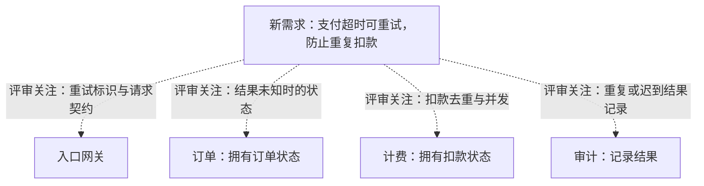

```mermaid
flowchart TB
    R[新需求：支付超时可重试，防止重复扣款]
    G[入口网关]
    O[订单：拥有订单状态]
    B[计费：拥有扣款状态]
    A[审计：记录结果]
    R -.->|评审关注：重试标识与请求契约| G
    R -.->|评审关注：结果未知时的状态| O
    R -.->|评审关注：扣款去重与并发| B
    R -.->|评审关注：重复或迟到结果记录| A
```

图中边表示评审关注，模块调用与事件链路尚未提供。已确认的是三项状态/记录职责；超时也不证明扣款失败。

先核实现有重试与幂等契约，包括标识传递、扣款去重和外部副作用保护；不足时再决定契约及责任分配。验证超时后实际已扣款、并发重试和迟到结果场景，检查是否仍只产生一次扣款。

未渲染验证。
