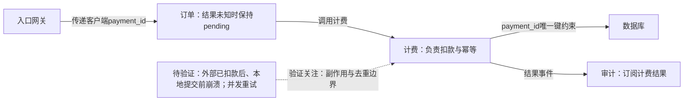

```mermaid
flowchart LR
    G[入口网关] -->|传递客户端payment_id| O[订单：结果未知时保持pending]
    O -->|调用计费| B[计费：负责扣款与幂等]
    B -->|payment_id唯一键约束| D[数据库]
    B -->|结果事件| A[审计：订阅计费结果]
    T[待验证：外部已扣款后、本地提交前崩溃；并发重试]
    T -.->|验证关注：副作用与去重边界| B
```

以上职责与唯一键机制已有设计记录，本次复用。待做的是补齐两类测试及证据：崩溃后恢复/重试不重复扣款，且订单最终能收敛；并发重试只产生一次扣款并获得一致结果。数据库唯一键不能单独证明外部扣款也具备相同保证；先按已有实现验证，发现缺口再评审修正。

未渲染验证。
