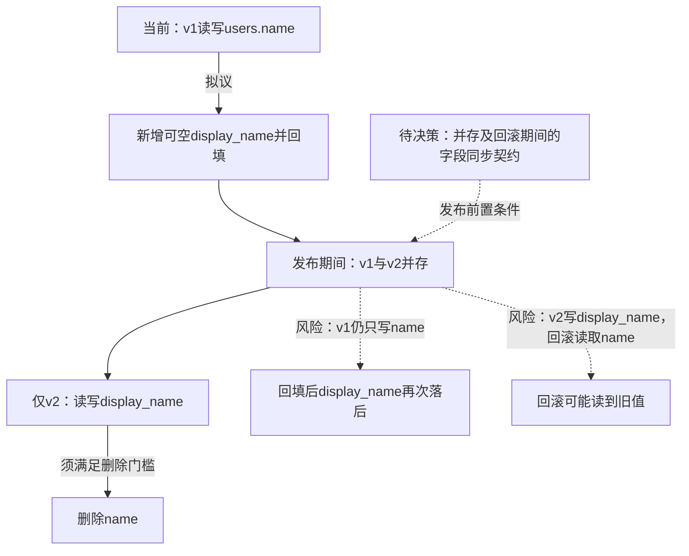

一次回填不能覆盖之后的v1写入，新增字段可空也不能保证v2读到有效值。先决定同步方向、冲突/空值处理、回填与并发写入的衔接，以及回滚时如何保留v2的新数据；当前不能假定双写已存在。

删除name前须确认：v1及其他读写name的依赖全部退出，历史与增量数据已对账，新路径和并发/回滚场景验证通过，并已结束回滚到依赖name版本的窗口，或建立验证过的恢复方案。仍需回滚到v1时保留name及有效同步能力。

未渲染验证。
