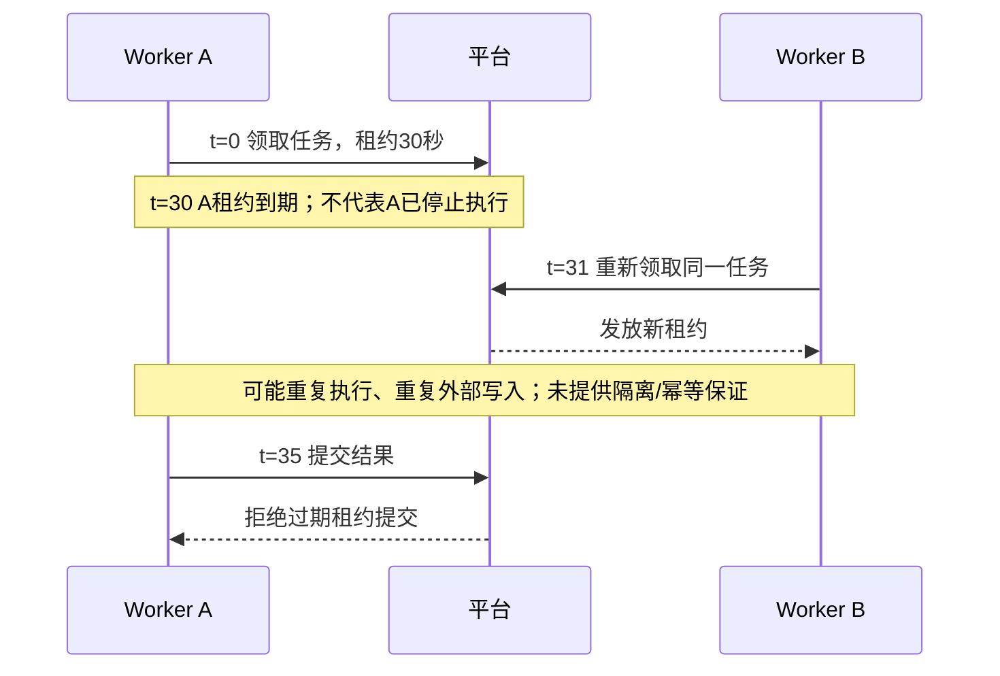

```mermaid
sequenceDiagram
    participant A as Worker A
    participant P as 平台
    participant B as Worker B
    A->>P: t=0 领取任务，租约30秒
    Note over A,P: t=30 A租约到期；不代表A已停止执行
    B->>P: t=31 重新领取同一任务
    P-->>B: 发放新租约
    Note over A,B: 可能重复执行、重复外部写入；未提供隔离/幂等保证
    A->>P: t=35 提交结果
    P-->>A: 拒绝过期租约提交
```

“任务只执行一次”不成立：拒绝A的结果只限制平台接收提交，不能撤销其执行或外部写入，也不能阻止A、B重复执行。B是否完成、实际是否重复写入均未知。

未渲染验证。
