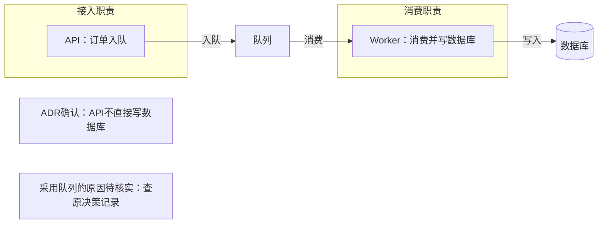

```mermaid
flowchart LR
    subgraph 接入职责
        A[API：订单入队]
    end
    Q[队列]
    subgraph 消费职责
        W[Worker：消费并写数据库]
    end
    D[(数据库)]
    A -->|入队| Q
    Q -->|消费| W
    W -->|写入| D
    N[ADR确认：API不直接写数据库]
    R[采用队列的原因待核实：查原决策记录]
```

图中行为来自题目；ADR确认API的写入边界。吞吐优化、故障隔离等只能作为候选解释，不能当作已确认的设计原因；需核对原决策及相关约束。

未渲染验证。
