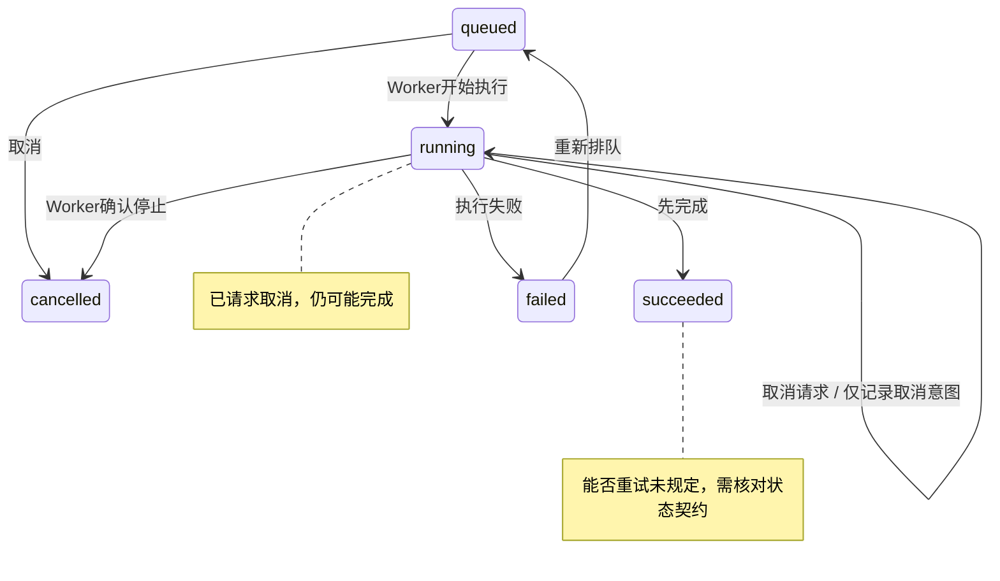

```mermaid
stateDiagram-v2
    queued --> running: Worker开始执行
    queued --> cancelled: 取消
    running --> running: 取消请求 / 仅记录取消意图
    running --> cancelled: Worker确认停止
    running --> succeeded: 先完成
    running --> failed: 执行失败
    failed --> queued: 重新排队
    note right of running
        已请求取消，仍可能完成
    end note
    note right of succeeded
        能否重试未规定，需核对状态契约
    end note
```

取消请求只表达意图，任务仍是running；Worker确认停止才表示取消完成。若先完成则进入succeeded，不能因已发取消请求就认定cancelled。

queued→running、running→failed按状态含义推断；其余转移由题目明确给出。未渲染验证。
