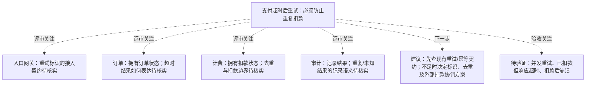

```mermaid
flowchart TB
    R[支付超时后重试：必须防止重复扣款]
    G[入口网关：重试标识的接入契约待核实]
    O[订单：拥有订单状态；超时结果如何表达待核实]
    B[计费：拥有扣款状态；去重与扣款边界待核实]
    A[审计：记录结果；重复/未知结果的记录语义待核实]
    R -.->|评审关注| G
    R -.->|评审关注| O
    R -.->|评审关注| B
    R -.->|评审关注| A
    C[建议：先查现有重试/幂等契约；不足时决定标识、去重及外部扣款协调方案]
    R -.->|下一步| C
    V[待验证：并发重试、已扣款但响应超时、扣款后崩溃]
    R -.->|验收关注| V
```

边表示评审关注，不代表模块调用。超时可能已扣款；订单和审计的状态/记录不能替代计费扣款的防重保证。没有资料不等于没有幂等方案，先核实现状，再补决策与证据。

未渲染验证。
