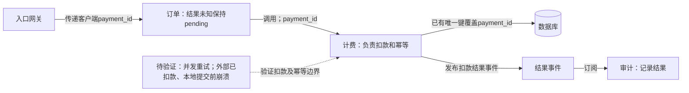

```mermaid
flowchart LR
    G[入口网关] -->|传递客户端payment_id| O[订单：结果未知保持pending]
    O -->|调用；payment_id| B[计费：负责扣款和幂等]
    B -->|已有唯一键覆盖payment_id| D[(数据库)]
    B -->|发布扣款结果事件| E[结果事件]
    E -->|订阅| A[审计：记录结果]
    T[待验证：并发重试；外部已扣款、本地提交前崩溃]
    T -.->|验证扣款及幂等边界| B
```

已有职责、payment_id和唯一键机制继续复用。本次重点是补两类测试：并发相同payment_id时不重复扣款；外部扣款成功后本地提交前崩溃，重试能恢复并避免再次扣款。数据库唯一键本身不能证明外部副作用只发生一次；若测试暴露缺口，再针对缺口修正。

来源：题目中的既有设计记录。未渲染验证。
