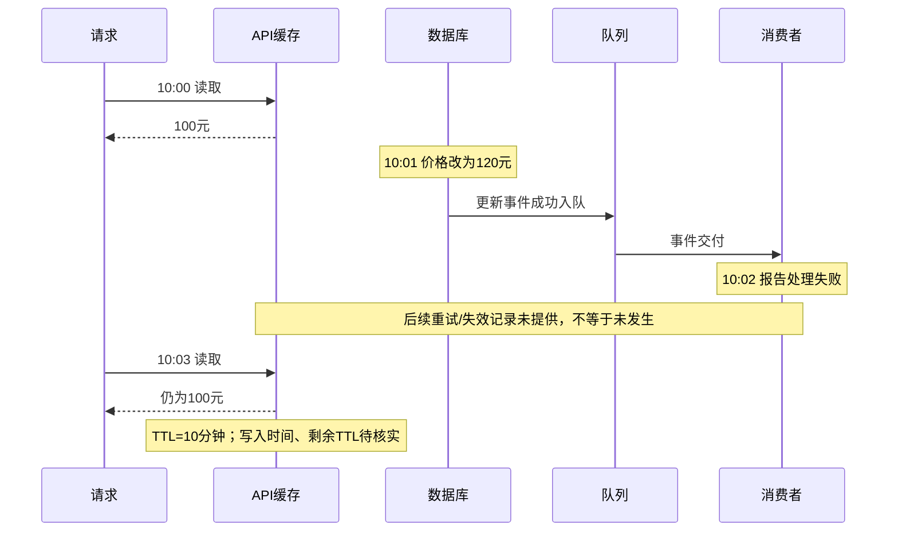

```mermaid
sequenceDiagram
    participant R as 请求
    participant C as API缓存
    participant D as 数据库
    participant Q as 队列
    participant W as 消费者
    R->>C: 10:00 读取
    C-->>R: 100元
    Note over D: 10:01 价格改为120元
    D->>Q: 更新事件成功入队
    Q->>W: 事件交付
    Note over W: 10:02 报告处理失败
    Note over W,C: 后续重试/失效记录未提供，不等于未发生
    R->>C: 10:03 读取
    C-->>R: 仍为100元
    Note over C: TTL=10分钟；写入时间、剩余TTL待核实
```

候选原因是事件失败后失效未完成，或重试/失效命中了错误键；时间顺序还不能证明因果。建议沿同一事件ID查失败步骤、确认及重试/死信记录，再核对缓存键、失效日志、写入时间和实际TTL。10:00命中不代表此时刚写入，不能据此推定10:10过期。

未渲染验证。
