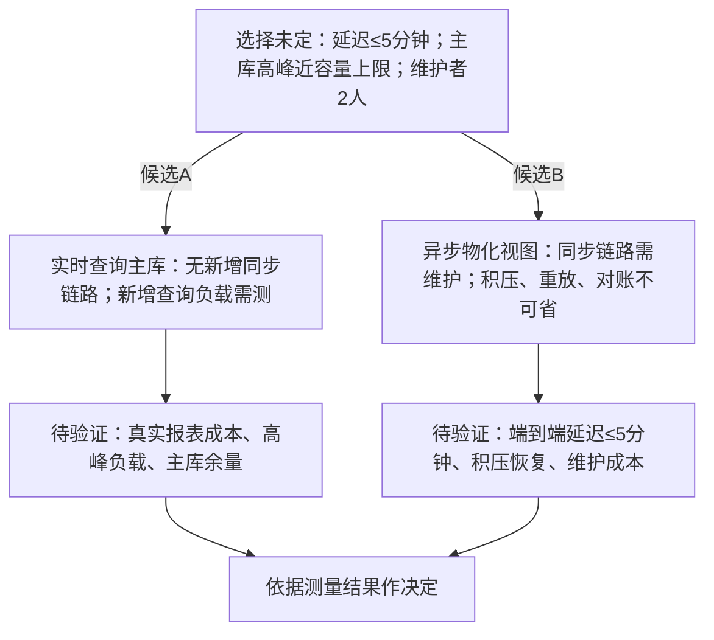

```mermaid
flowchart TB
    C[选择未定：延迟≤5分钟；主库高峰近容量上限；维护者2人]
    C -->|候选A| A[实时查询主库：无新增同步链路；新增查询负载需测]
    C -->|候选B| B[异步物化视图：同步链路需维护；积压、重放、对账不可省]
    A --> VA[待验证：真实报表成本、高峰负载、主库余量]
    B --> VB[待验证：端到端延迟≤5分钟、积压恢复、维护成本]
    VA --> D[依据测量结果作决定]
    VB --> D
```

建议优先验证物化视图，因可接受延迟且主库余量紧张；前提是它能减少主库压力，并由两人维持延迟与恢复目标。若报表成本很低、实测主库有余量，而同步运维负担过高，则实时查询更合适。先以代表性报表做高峰负载测试，再测同步积压、重放及对账成本，当前证据不足以定案。

未渲染验证。
