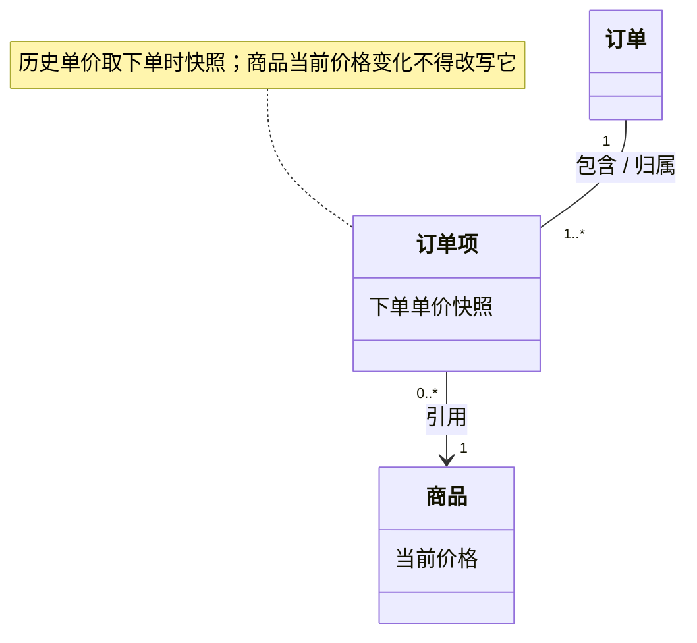

```mermaid
classDiagram
    class 订单
    class 订单项 {
        下单单价快照
    }
    class 商品 {
        当前价格
    }
    订单 "1" -- "1..*" 订单项 : 包含 / 归属
    订单项 "0..*" --> "1" 商品 : 引用
    note for 订单项 "历史单价取下单时快照；商品当前价格变化不得改写它"
```

这是领域关系：每项只属一个订单、引用一个商品；商品可被零到多个订单项引用。单价快照与当前价格是两个不同语义的值。图不规定数据库表、外键、级联删除或ORM实现，这些尚未设计。

未渲染验证。
