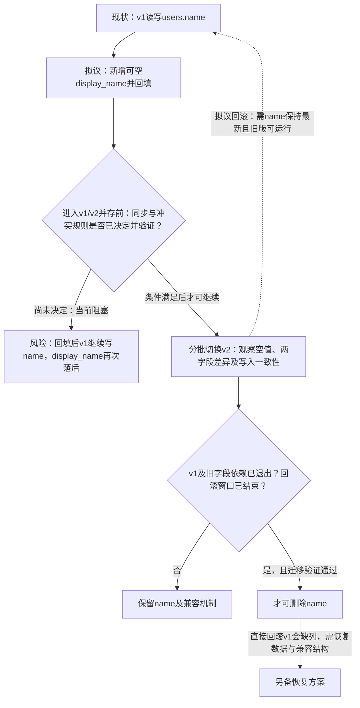

```mermaid
flowchart TB
    A[现状：v1读写users.name] --> B[拟议：新增可空display_name并回填]
    B --> C{进入v1/v2并存前：同步与冲突规则是否已决定并验证？}
    C -->|尚未决定：当前阻塞| X[风险：回填后v1继续写name，display_name再次落后]
    C -->|条件满足后才可继续| D[分批切换v2：观察空值、两字段差异及写入一致性]
    D --> E{v1及旧字段依赖已退出？回滚窗口已结束？}
    E -->|否| K[保留name及兼容机制]
    E -->|是，且迁移验证通过| F[才可删除name]
    D -.->|拟议回滚：需name保持最新且旧版可运行| A
    F -.->|直接回滚v1会缺列，需恢复数据与兼容结构| R[另备恢复方案]
```

回填只是历史快照，不能解决并存期写入。需决定两字段同步、权威值与冲突规则，并明确v2读取空值的行为；不能假定已有双写。用并发更新、回填期间写入和实际回滚演练验证一致性。只有旧实例与依赖全部退出、display_name完整且最新、旧版回滚需求结束后，才进入删列步骤；否则必须保留name。

图中流程是建议的发布门槛，并非已完成部署。未渲染验证。
