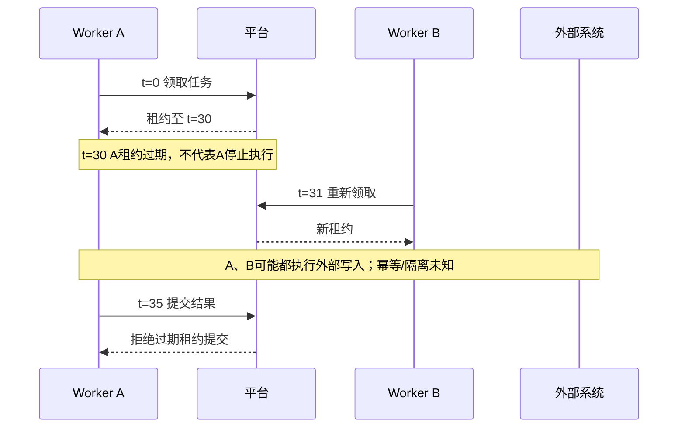

```mermaid
sequenceDiagram
    participant A as Worker A
    participant P as 平台
    participant B as Worker B
    participant E as 外部系统
    A->>P: t=0 领取任务
    P-->>A: 租约至 t=30
    Note over A,P: t=30 A租约过期，不代表A停止执行
    B->>P: t=31 重新领取
    P-->>B: 新租约
    Note over A,E: A、B可能都执行外部写入；幂等/隔离未知
    A->>P: t=35 提交结果
    P-->>A: 拒绝过期租约提交
```

“任务只执行一次”不成立：重新领取允许重复执行，拒绝A的结果也不能撤销外部副作用。已知保证仅是拒绝过期提交；是否避免重复外部写入，需核实幂等或隔离机制。未渲染验证。
