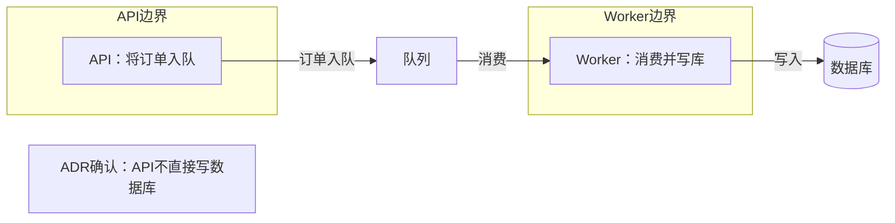

```mermaid
flowchart LR
    subgraph API边界
        A[API：将订单入队]
    end
    Q[队列]
    subgraph Worker边界
        W[Worker：消费并写库]
    end
    D[(数据库)]
    A -->|订单入队| Q
    Q -->|消费| W
    W -->|写入| D
    N[ADR确认：API不直接写数据库]
```

图中处理关系来自题目，ADR确认写库职责不在API。吞吐优化、故障隔离及选择队列的原因均未确认，不能从现有结构推导；需查原决策记录，缺失时再确认设计意图。未渲染验证。
