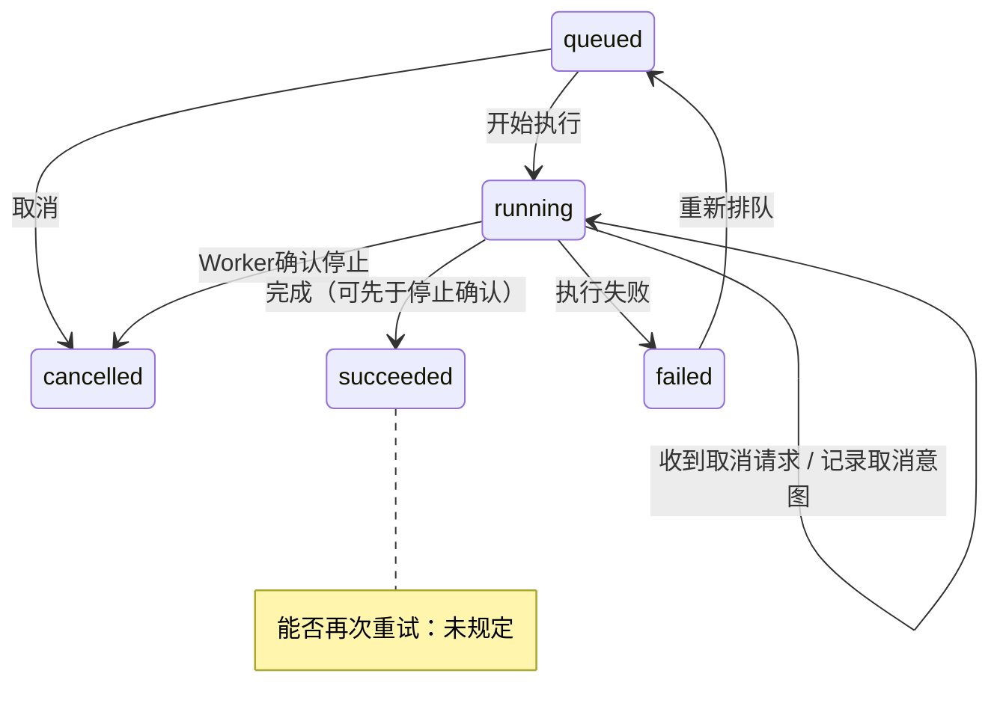

```mermaid
stateDiagram-v2
    queued --> running: 开始执行
    queued --> cancelled: 取消
    running --> running: 收到取消请求 / 记录取消意图
    running --> cancelled: Worker确认停止
    running --> succeeded: 完成（可先于停止确认）
    running --> failed: 执行失败
    failed --> queued: 重新排队
    note right of succeeded
        能否再次重试：未规定
    end note
```

取消请求只记录意图，任务仍是running；Worker确认停止才是取消完成。期间可能先完成进入succeeded，不能把请求取消当成成功停止。succeeded的重试规则需补充确认。未渲染验证。
