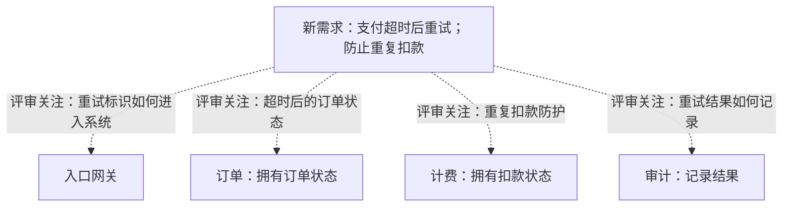

```mermaid
flowchart TB
    R[新需求：支付超时后重试；防止重复扣款]
    G[入口网关]
    O[订单：拥有订单状态]
    B[计费：拥有扣款状态]
    A[审计：记录结果]
    R -.->|评审关注：重试标识如何进入系统| G
    R -.->|评审关注：超时后的订单状态| O
    R -.->|评审关注：重复扣款防护| B
    R -.->|评审关注：重试结果如何记录| A
```

节点职责已知；虚线仅表示评审关注，模块调用关系尚未提供。超时不证明扣款失败。

先核实现有重试/幂等契约，包括标识传递、去重范围与并发保证；若不足，再决定防重复扣款方案及未知结果的处理方式。验证“已扣款但响应超时”和并发重试场景，审计应能追踪最终结果。未渲染验证。
