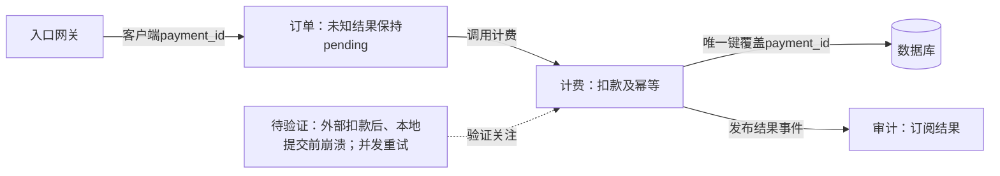

```mermaid
flowchart LR
    G[入口网关] -->|客户端payment_id| O[订单：未知结果保持pending]
    O -->|调用计费| B[计费：扣款及幂等]
    B -->|唯一键覆盖payment_id| D[(数据库)]
    B -->|发布结果事件| A[审计：订阅结果]
    T[待验证：外部扣款后、本地提交前崩溃；并发重试]
    T -.->|验证关注| B
```

现有设计已确认幂等归属和唯一键，本次应补充两类测试证据：崩溃恢复后重试是否重复扣款、结果能否最终收敛；相同payment_id并发重试是否只产生一次扣款并返回一致结果。数据库唯一键本身不足以证明外部扣款与本地提交间的故障安全。失败时再定位现有机制的缺口。未渲染验证。
