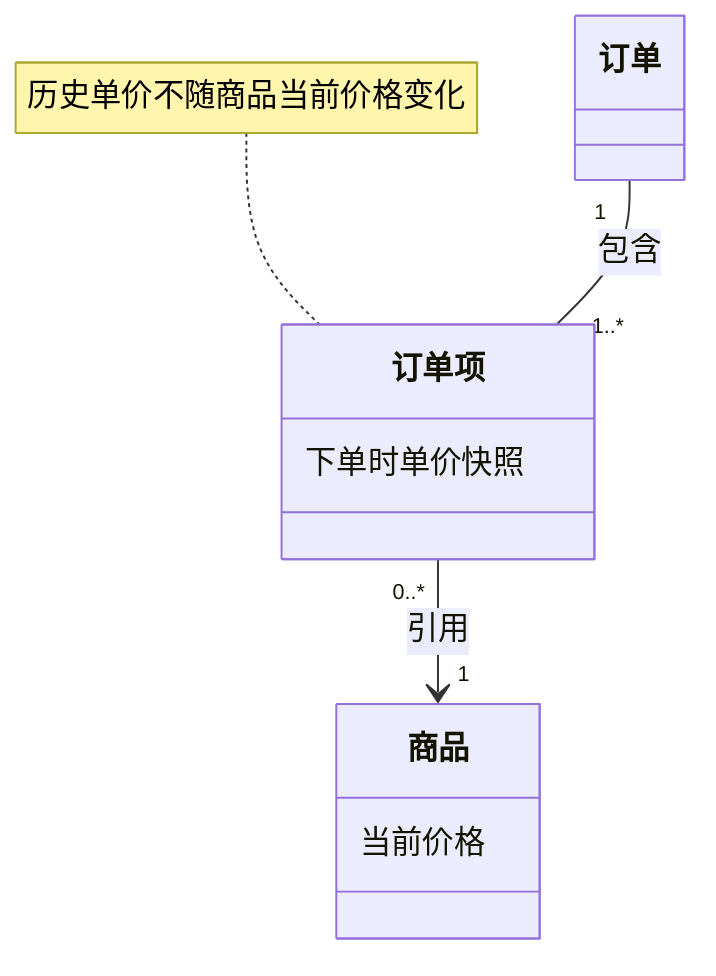

```mermaid
classDiagram
    class 订单
    class 订单项 {
        下单时单价快照
    }
    class 商品 {
        当前价格
    }
    订单 "1" -- "1..*" 订单项 : 包含
    订单项 "0..*" --> "1" 商品 : 引用
    note for 订单项 "历史单价不随商品当前价格变化"
```

这是领域关系：订单至少有一个订单项，每项只属于一个订单、引用一个商品；商品可以没有订单项引用。下单时保存单价快照，之后商品调价不能改写历史价格。数据库表、外键、级联删除及ORM映射尚未设计，图中不作实现承诺。未渲染验证。
