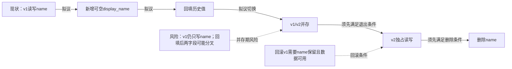

回填只是某时点的数据复制，不能覆盖之后的v1写入；当前拟议步骤缺少并存期同步决定，直接切换可能让v2读到空值或旧值。v2的新写入若未同步name，回滚v1也可能读到旧值。

先决定两字段的写入权威、同步方式、冲突处理及v2空值读取策略，再验证并发写、回填期间更新与回滚的数据一致性。仅在v1及其他name依赖全部退出、同步与迁移核对通过、回滚窗口结束或替代恢复方案验证完成后，才可删除name；删列后不能直接回滚v1。未渲染验证。
