# 第二轮：十题、五组独立生成对照

逐字汇集未改写的原始文件；语法解析与事实审阅见 [主报告](README.md)。显示效果取决于阅读平台，本轮未验证布局。

## 01-lease

Worker A 领取任务，租约为30秒。A在第35秒提交，期间Worker B在第31秒重新领取。平台会拒绝过期租约的结果提交，但题目没有提供对外部写入的幂等或隔离保证。画出时序并判断“任务只执行一次”是否成立。请简短中文回答，不写项目文档。

### show-me

[原文件](repeat-outputs/show-me/01-lease.md)

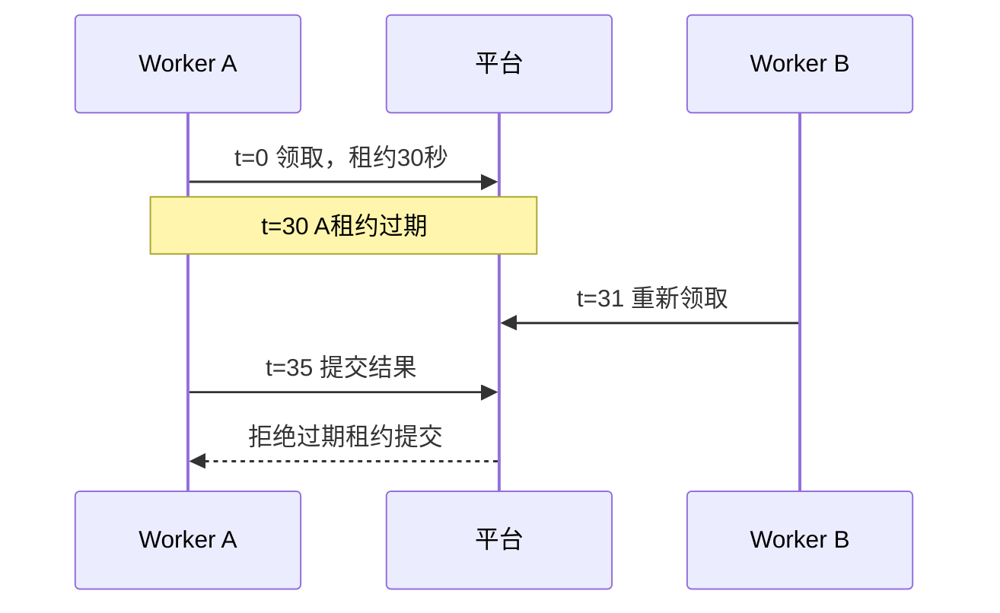
“任务只执行一次”不成立：租约限制结果提交，不能证明执行次数。A、B可能执行同一任务；外部写入是否重复尚无保证，需要外部幂等或隔离机制及验证。


### mermaid-diagrams

[原文件](repeat-outputs/mermaid-diagrams/01-lease.md)

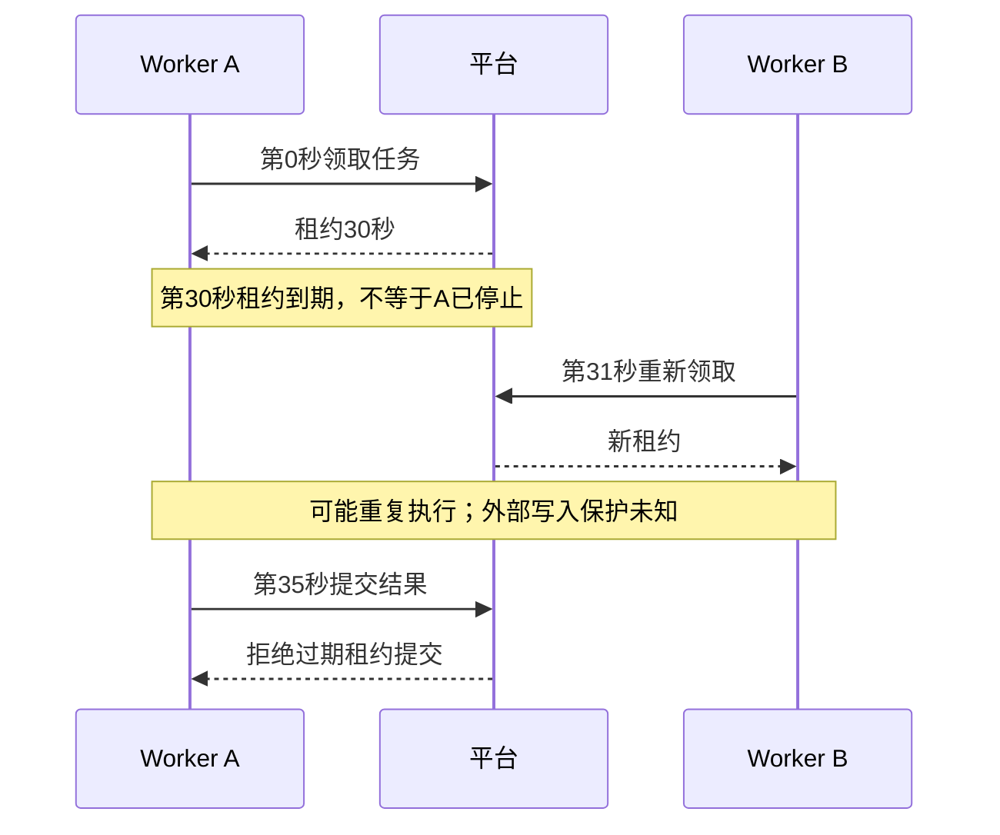

“任务只执行一次”不成立：重新领取允许重复执行，拒绝A的提交只保护平台结果接收，不能证明外部副作用只发生一次。是否实际重复写入仍需证据。


### visual-v030

[原文件](repeat-outputs/visual-v030/01-lease.md)

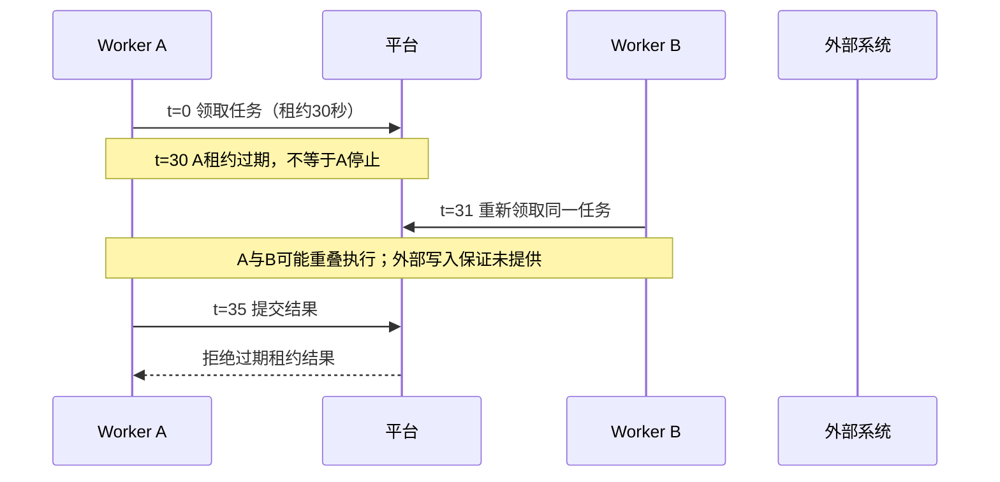

“任务只执行一次”不成立。租约校验限制结果提交，不能证明执行或外部副作用只有一次：A可能已写外部系统，B重新执行又写一次。需核实外部写入的幂等或隔离机制，并验证过期Worker与新Worker重叠的场景；不能从拒绝提交推导外部写入已撤销。

未渲染验证。


### visual-v031

[原文件](repeat-outputs/visual-v031/01-lease.md)

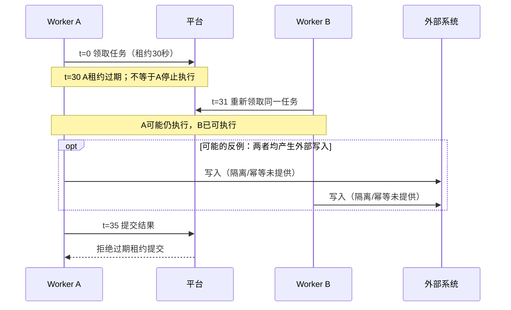

“任务只执行一次”不成立为已保证性质：拒绝提交只约束平台接收结果，不能撤销外部副作用，也不能阻止A、B重复执行。图中外部写入是允许的反例，并非已观测事实；需核实外部写入的幂等或隔离契约。

未渲染验证。


### visual-v032-candidate

[原文件](repeat-outputs/visual-v032-candidate/01-lease.md)

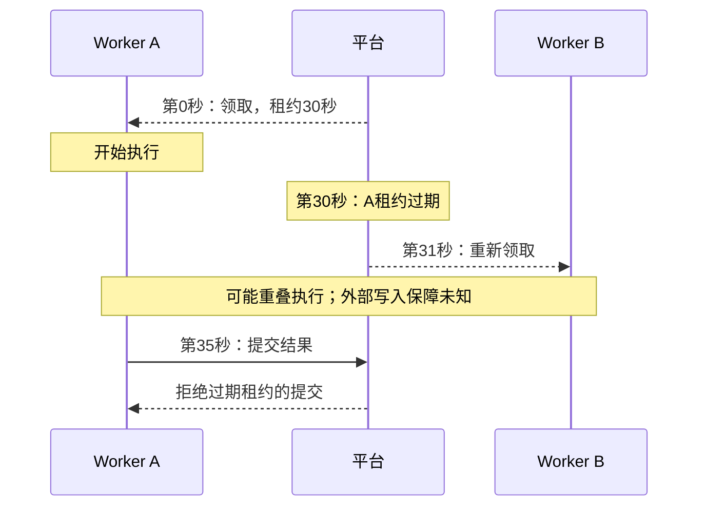

“任务只执行一次”不成立：重新领取允许再次执行，拒绝 A 的结果不撤销其已发生的外部写入。A、B 都写入外部系统是允许的反例；需核实幂等或隔离机制，才能判断副作用是否重复。图未渲染验证。


## 02-intent

已知API将订单入队，Worker消费队列并写入数据库；ADR只确认API不直接写数据库。没有吞吐、隔离故障或选择队列原因的资料。画出职责边界，说明哪些是事实，哪些设计原因尚未确认。请简短中文回答，不写项目文档。

### show-me

[原文件](repeat-outputs/show-me/02-intent.md)

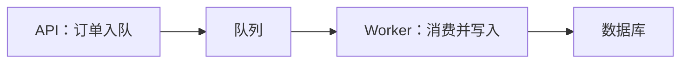
事实：API入队，Worker消费后写数据库；ADR确认API不直接写数据库。

未确认：为何选择队列、是否为了吞吐或故障隔离，以及实际效果。职责分离是已知结构，设计动机需补充决策记录或证据。


### mermaid-diagrams

[原文件](repeat-outputs/mermaid-diagrams/02-intent.md)

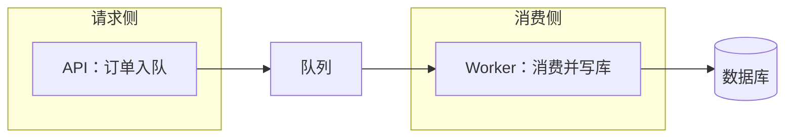

事实：API入队，Worker消费并写数据库；ADR确认API不直接写库。

尚未确认：为何选择队列、是否为提高吞吐或隔离故障，以及这些效果是否达成。职责分离本身不能证明这些设计原因。


### visual-v030

[原文件](repeat-outputs/visual-v030/02-intent.md)

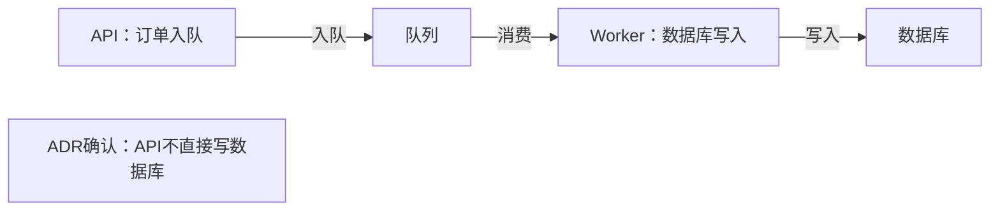

事实是上述入队、消费、写入职责，以及ADR确认的边界。采用队列是否为了吞吐、故障隔离或其他目标，尚未确认；当前结构不能证明这些设计原因。下一步查原决策记录或向决策者核实理由。

未渲染验证。


### visual-v031

[原文件](repeat-outputs/visual-v031/02-intent.md)

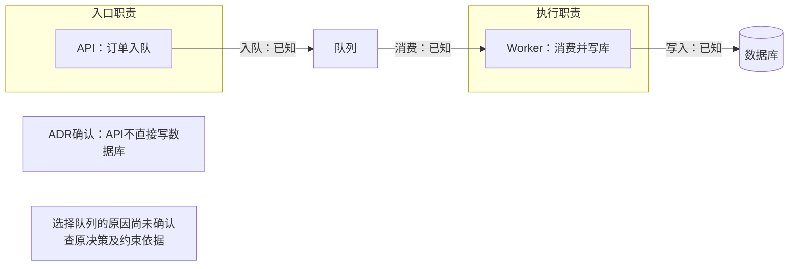

事实是图中的入队、消费和写库职责，以及ADR确认的API写库边界。吞吐优化、故障隔离等只能作为待核实的设计理由；现有结构不能证明这些动机，需查原决策记录。

未渲染验证。


### visual-v032-candidate

[原文件](repeat-outputs/visual-v032-candidate/02-intent.md)

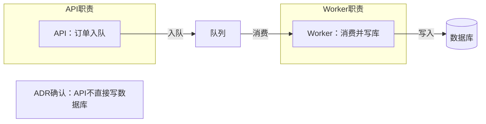

实线是题目提供的行为，ADR 只确认写库边界。选择队列是否为了吞吐、故障隔离或其他目标尚未确认；应查决策记录，不能从当前结构反推出原因。图未渲染验证。


## 03-diff

旧逻辑：每次save都write。新逻辑：内容未变化时直接返回缓存；变化时write再失效缓存。用最容易看懂的方式说明改动。请简短中文回答，不写项目文档。

### show-me

[原文件](repeat-outputs/show-me/03-diff.md)

```diff
 on(save)
+  if 内容未变化
+    return 缓存
   write 内容
+  失效缓存
```
未变化时跳过写入并返回缓存；变化时先写入，再让缓存失效。


### mermaid-diagrams

[原文件](repeat-outputs/mermaid-diagrams/03-diff.md)

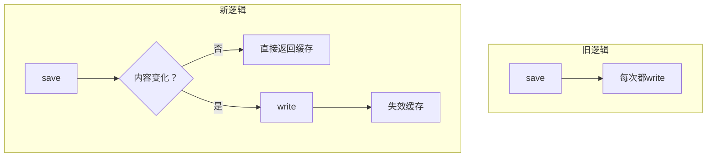

改动是跳过未变化内容的写入；内容变化时仍写入，再失效缓存。图中顺序不能交换为先失效再写入。


### visual-v030

[原文件](repeat-outputs/visual-v030/03-diff.md)

```diff
 on(save)
+  if content is unchanged
+    return cached result
   write content
+  invalidate cache
```

未变化时直接返回缓存，跳过写入；有变化时先写入，再使缓存失效。


### visual-v031

[原文件](repeat-outputs/visual-v031/03-diff.md)

```diff
 on(save)
+  if 内容未变化
+    return 缓存结果
   write 内容
+  失效缓存
```

未变化时跳过写入，直接返回缓存；变化时先写入，再失效缓存。


### visual-v032-candidate

[原文件](repeat-outputs/visual-v032-candidate/03-diff.md)

```diff
 on(save)
+  if content is unchanged
+    return cached result
   write content
+  invalidate cache
```

未变化时省去写入并返回缓存；变化时先写入，再让缓存失效。


## 04-state

一个任务有 queued、running、succeeded、failed、cancelled 五种状态。queued 可取消；running 收到取消请求后，只记录取消意图，只有 Worker 确认停止才进入 cancelled。running 也可能先完成并进入 succeeded。failed 可重新排队。没有规定 succeeded 能否再次重试。请画状态关系并解释取消请求与取消完成的区别。简短中文，不写项目文档。

### show-me

[原文件](repeat-outputs/show-me/04-state.md)

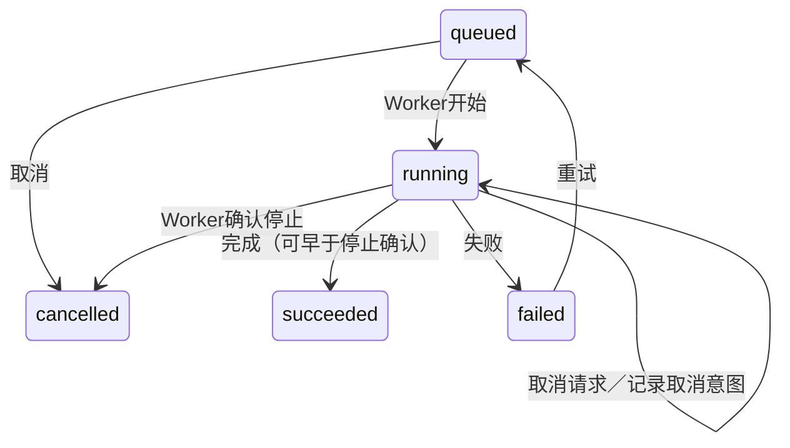
取消请求只记录意图，任务仍是running；取消完成需要Worker确认停止。完成先发生时可进入succeeded。succeeded能否重试未规定，图中不补这条边。


### mermaid-diagrams

[原文件](repeat-outputs/mermaid-diagrams/04-state.md)

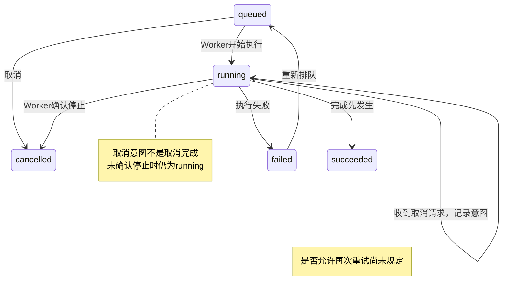

取消请求只记录意图；Worker确认停止才完成取消。请求与完成可能竞争，因此收到取消请求后仍可能进入succeeded。没有依据添加succeeded的重试转移。


### visual-v030

[原文件](repeat-outputs/visual-v030/04-state.md)

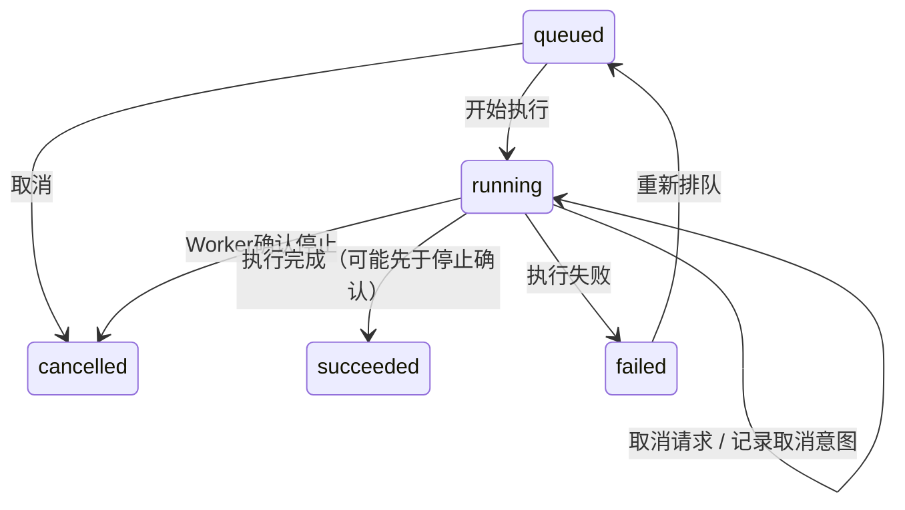

取消请求仅记录意图，任务仍是running；Worker确认停止才算取消完成。请求取消后也可能先完成并进入succeeded，不能承诺请求一到就取消成功。图中开始执行、执行失败为按状态语义推断的转移；succeeded能否重试未规定，需核实规则，不能擅自添加转移或认定不可重试。

未渲染验证。


### visual-v031

[原文件](repeat-outputs/visual-v031/04-state.md)

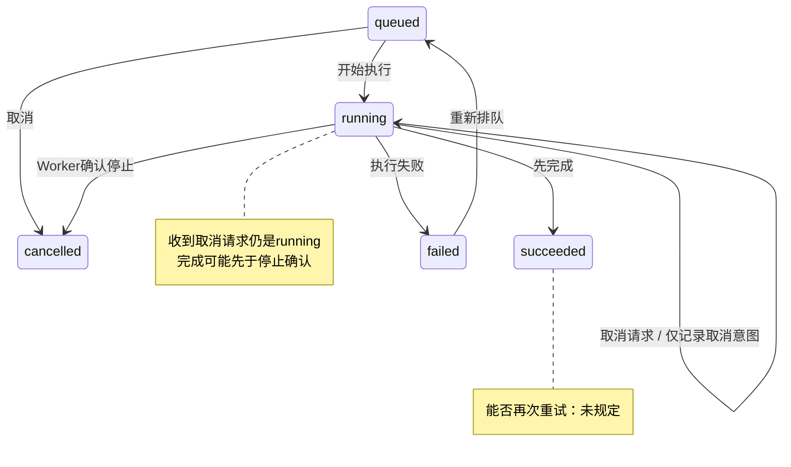

取消请求表达意图，取消完成要求Worker确认停止；因此收到请求不保证最终进入cancelled，也可能先进入succeeded。succeeded的重试规则需核实，图中不补设转移。

未渲染验证。


### visual-v032-candidate

[原文件](repeat-outputs/visual-v032-candidate/04-state.md)

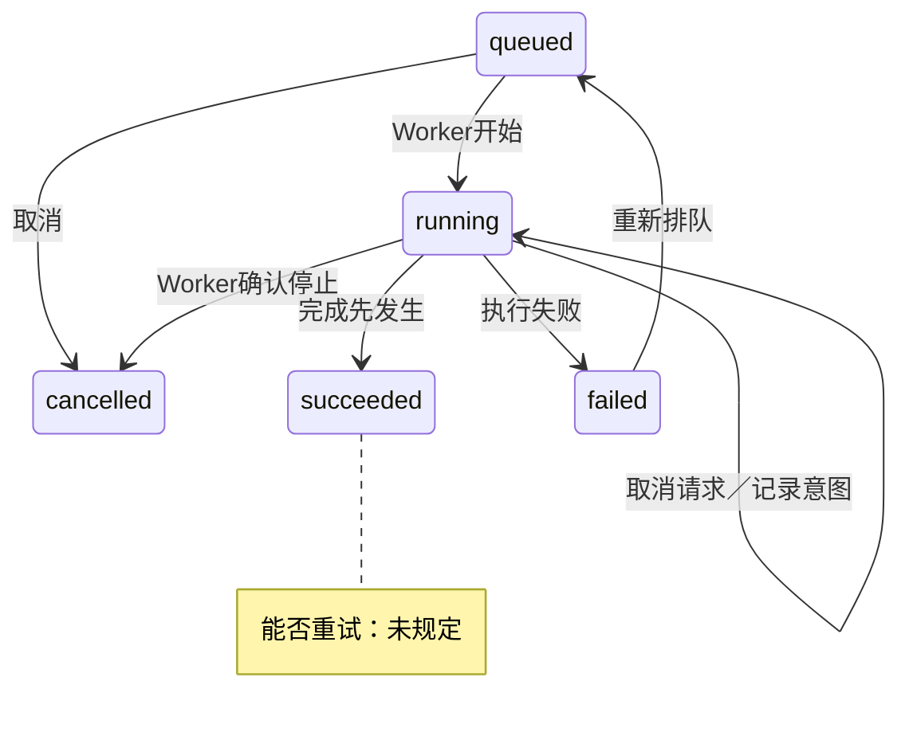

running 中收到取消请求仍是 running，只有 Worker 确认停止才是 cancelled；完成可能抢先发生，进入 succeeded。取消请求不保证取消完成。succeeded 的重试规则需要确认，图未补造转移。图未渲染验证。


## 05-scope

系统有入口网关、订单模块、计费模块和审计模块。已有决定：订单拥有订单状态，计费拥有扣款状态，审计记录结果。新需求允许支付超时后重试，必须防止重复扣款。没有现成的幂等设计资料。请用图帮助评审影响边界，区分已知职责和需要决定/验证的地方。简短中文，不写项目文档。

### show-me

[原文件](repeat-outputs/show-me/05-scope.md)

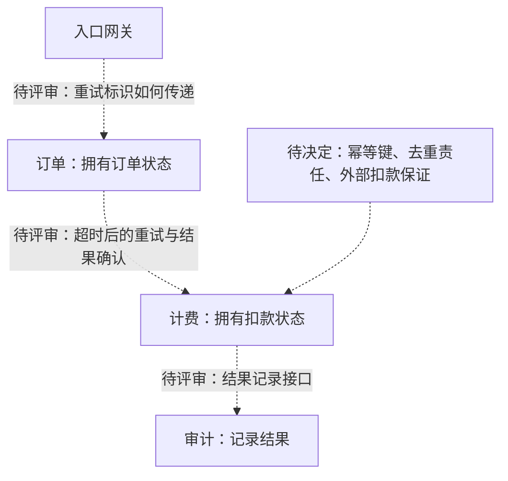
节点职责已确定；虚线表示待评审接口，不能当作已有调用链。

重试会触及入口标识、订单未知结果处理、计费重复扣款防护及审计记录。需决定幂等机制与责任，再验证并发重试、超时但已扣款、崩溃恢复时是否仍只扣一次。


### mermaid-diagrams

[原文件](repeat-outputs/mermaid-diagrams/05-scope.md)

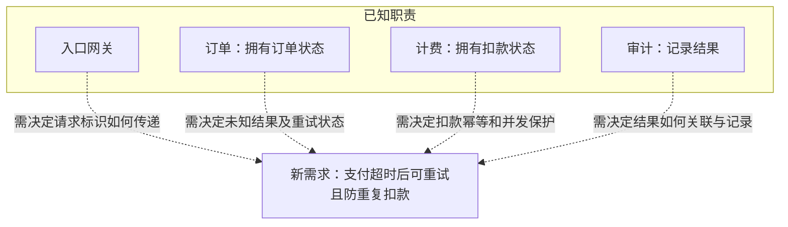

虚线表示评审影响，不代表已有调用链或机制。需明确同一支付的稳定标识、幂等范围与保存方式、外部扣款后崩溃的恢复和结果查询方式；验证并发重试及超时重试不会重复扣款。超时不能直接视为扣款失败。


### visual-v030

[原文件](repeat-outputs/visual-v030/05-scope.md)

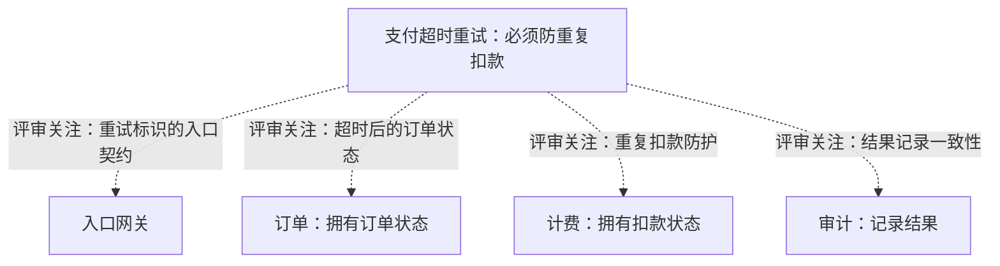

职责是已知决定；虚线仅表示评审关注，不断言模块调用链。超时可能发生在已扣款之后，不能直接按失败重新扣款。

先核实现有重试/幂等契约与相关记录：标识如何贯穿重试，计费如何去重，订单如何识别未知结果。若现有方案不足，再决定幂等责任、标识范围及未知结果恢复方式；验证并发重试和扣款成功但响应丢失两个关键场景。

未渲染验证。


### visual-v031

[原文件](repeat-outputs/visual-v031/05-scope.md)

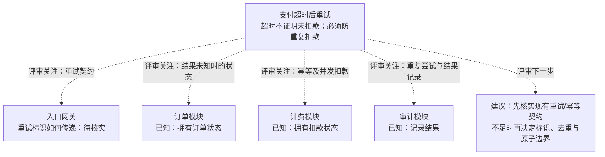

连线表示评审关注，不代表模块调用关系。先查现有接口、实现和设计记录；没有提供幂等资料不能判定机制不存在。待验证的关键场景是并发重试、已扣款但响应超时，以及崩溃恢复；确认机制不足后再决定补充方案。

未渲染验证。


### visual-v032-candidate

[原文件](repeat-outputs/visual-v032-candidate/05-scope.md)

```mermaid
flowchart TB
    R[新需求：支付超时后可重试，防重复扣款]
    G[入口网关]
    O[订单：拥有订单状态]
    B[计费：拥有扣款状态]
    A[审计：记录结果]
    R -.->|评审关注：重试标识与传递| G
    R -.->|评审关注：结果未知时的订单状态| O
    R -.->|评审关注：扣款幂等与并发| B
    R -.->|评审关注：重试结果记录| A
```

虚线只表示评审关注，不证明模块间调用。已知的是各自职责；超时不能直接判为扣款失败。

先核实现有重试/幂等契约，包括标识、去重边界和结果查询；资料不足不等于机制不存在。不足时再决定责任与契约，并验证“外部已扣款后超时”和并发重试不会重复扣款。图未渲染验证。


## 06-existing

评审支付超时重试需求。已有设计记录明确：入口网关向订单模块传递客户端payment_id；订单调用计费，计费负责扣款和幂等，已有数据库唯一键覆盖payment_id；审计订阅计费的结果事件。订单在支付结果未知时保持pending。尚未提供“外部已扣款但本地提交前崩溃”和“并发重试”的测试结果。请用图解释当前职责和本次需要做的工作，不重新设计已确认机制。简短中文，不写项目文档。

### show-me

[原文件](repeat-outputs/show-me/06-existing.md)

```mermaid
flowchart LR
    G[网关] -->|客户端payment_id| O[订单：未知结果保持pending]
    O -->|payment_id| B[计费：扣款与幂等]
    B --> D[数据库：payment_id唯一键]
    B -->|结果事件| A[审计订阅]
```
以上机制已确认，沿用即可。本次补验证：

- 外部已扣款、本地提交前崩溃：重试是否重复扣款，能否恢复并确认结果。
- 并发重试：同一payment_id是否只产生一次扣款，订单和审计能否得到一致结果。

本地唯一键本身不能证明外部扣款安全；测试结果尚缺，发现缺口后再决定修补。


### mermaid-diagrams

[原文件](repeat-outputs/mermaid-diagrams/06-existing.md)

```mermaid
sequenceDiagram
    participant G as 入口网关
    participant O as 订单
    participant B as 计费
    participant D as 计费数据库
    participant A as 审计
    G->>O: 客户端payment_id
    O->>B: 调用计费，携带payment_id
    Note over B,D: 已确认：计费负责扣款和幂等<br/>数据库唯一键覆盖payment_id
    B->>D: 保存扣款相关记录
    B-)A: 结果事件，审计订阅
    Note over O: 支付结果未知时保持pending
```

本次沿用已确认机制，补做两类验证：外部已扣款但本地提交前崩溃后的恢复；同一payment_id并发重试。检查外部只扣一次、结果可恢复、pending最终能收敛。数据库唯一键不能单独证明外部扣款在崩溃窗口也受保护；测试结果尚缺。


### visual-v030

[原文件](repeat-outputs/visual-v030/06-existing.md)

```mermaid
flowchart LR
    G[入口网关] -->|客户端payment_id| O[订单：结果未知时pending]
    O -->|调用，传递payment_id| B[计费：扣款与幂等]
    B -->|已有payment_id唯一键| D[数据库]
    B -->|结果事件| A[审计：订阅并记录]
```

以上职责、标识传递和唯一键均已由设计记录确认，本次沿用。唯一键本身不能证明外部扣款与本地提交之间的异常已安全处理。

本次重点是补验证证据：①外部已扣款、本地提交前崩溃后重试，确认不再扣款且最终结果可恢复；②同一payment_id并发重试，确认扣款次数、数据库结果及返回结果一致。核对现有崩溃恢复路径并验证pending最终如何收敛；发现机制缺口后再讨论改动。

未渲染验证。


### visual-v031

[原文件](repeat-outputs/visual-v031/06-existing.md)

```mermaid
flowchart LR
    G[入口网关] -->|传递客户端payment_id| O[订单模块<br/>支付结果未知：保持pending]
    O -->|调用| B[计费模块<br/>负责扣款和幂等]
    B -->|本地幂等依据| D[(数据库<br/>payment_id唯一键)]
    B -->|结果事件| A[审计模块：订阅并记录]
    V[待验证<br/>①外部已扣款、本地提交前崩溃<br/>②并发重试]
    V -.->|验证关注：端到端扣款效果| B
```

沿用已有设计记录中的职责与唯一键。唯一键本身不足以证明外部扣款全过程幂等；本次应补齐图中两类测试，检查重复扣款、恢复后的结果与pending收敛。测试若暴露缺口，再据证据修正机制。

未渲染验证。


### visual-v032-candidate

[原文件](repeat-outputs/visual-v032-candidate/06-existing.md)

```mermaid
flowchart LR
    G[入口网关] -->|客户端payment_id| O[订单：结果未知保持pending]
    O -->|调用| B[计费：扣款与幂等]
    B -->|唯一键覆盖payment_id| D[(计费数据库)]
    B -->|结果事件；审计订阅| A[审计]
    T[待验证：外部已扣款后本地提交前崩溃；并发重试]
    T -.->|验证关注| B
```

职责、标识传递和唯一键均已确认，继续使用现有机制。本次补齐两类测试：崩溃后重试应能恢复扣款结果且不再次扣款；同一 payment_id 并发重试应只产生一次扣款并得到一致结果。唯一键本身不能证明跨外部扣款与本地提交的崩溃窗口安全；若测试暴露缺口，再定位修复。图未渲染验证。


## 07-incident

一次请求在10:00命中API缓存并返回价格100元；10:01数据库价格改为120元，更新事件成功写入队列；10:02消费者报告该事件处理失败，随后没有提供重试或缓存失效记录；10:03请求仍从缓存读到100元。缓存TTL为10分钟。请用图解释已知过程、候选原因和下一步排查，不把时间先后当作已证明的因果。简短中文，不写项目文档。

### show-me

[原文件](repeat-outputs/show-me/07-incident.md)

```text
时间    已知记录
10:00   请求命中API缓存，返回100元
10:01   数据库改为120元；更新事件成功入队
10:02   消费者报告该事件处理失败
之后    未提供重试或缓存失效记录
10:03   请求仍命中缓存，返回100元
配置    缓存TTL为10分钟
```
候选原因：消费失败可能阻断失效；也可能是重试未成功、失效键或缓存节点不匹配。先后顺序不能证明因果，缺少记录也不等于没有重试。

下一步按事件ID核对失败异常、重试/死信及失效日志，再核对请求缓存键、节点、写入/续期时间与TTL。10:00是命中时间，不能直接认定10:10过期。


### mermaid-diagrams

[原文件](repeat-outputs/mermaid-diagrams/07-incident.md)

```mermaid
sequenceDiagram
    participant R as 请求
    participant C as API缓存
    participant D as 数据库
    participant Q as 队列
    participant W as 消费者
    R->>C: 10:00读取价格
    C-->>R: 命中100元
    Note over D: 10:01价格改为120元
    D-)Q: 更新事件成功入队
    Q-)W: 更新事件
    Note over W: 10:02报告处理失败<br/>后续重试、失效记录未提供
    R->>C: 10:03读取价格
    C-->>R: 仍命中100元
    Note over C: TTL为10分钟；实际写入及续期时间未知
```

候选解释：消费失败可能阻断缓存失效，旧值仍在TTL内；也可能有失效键不匹配或旧值被重新填充。时间先后不能证明消费失败就是根因，缺少记录也不等于没有重试。

下一步按事件ID追踪失败阶段、重试及死信，核对缓存键与失效日志，再查写入时间、剩余TTL和重新填充来源。10:00命中不代表TTL从10:00开始。


### visual-v030

[原文件](repeat-outputs/visual-v030/07-incident.md)

```mermaid
sequenceDiagram
    participant R as 请求
    participant C as API缓存
    participant D as 数据库
    participant Q as 队列
    participant W as 消费者
    R->>C: 10:00 查询价格
    C-->>R: 命中100元
    Note over D: 10:01 价格改为120元
    D->>Q: 更新事件成功入队
    Q->>W: 事件交付
    Note over W: 10:02 报告处理失败
    Note over W,C: 后续重试、缓存失效记录未提供
    R->>C: 10:03 查询价格
    C-->>R: 命中100元（TTL为10分钟）
```

候选原因是失败后未完成缓存失效；也可能失效目标键不匹配，或缓存被旧值重新填充。现有时间线不能证明哪一种导致旧价；TTL为10分钟也不能据10:00命中推算缓存写入时间和确切过期点。

下一步关联同一事件ID核查失败原因及重试/死信记录，再核查相应缓存键的失效、写入和过期时间。用这些证据区分“没失效”“失效错键”和“失效后旧值回填”。

未渲染验证。


### visual-v031

[原文件](repeat-outputs/visual-v031/07-incident.md)

```text
已知观测（按时间排列，不代表因果已证实）
10:00  API命中缓存，返回100元
10:01  数据库变为120元；更新事件成功入队
10:02  消费者报告该事件处理失败
       └─ 后续重试/失效记录：未提供
10:03  API仍命中缓存，返回100元
       └─ TTL=10分钟；缓存起算/刷新时间未知

候选原因                         下一步核查
失败后未成功失效缓存 ──────────→ 跟踪该事件的重试、死信及失效记录
失效键不匹配/读到其他缓存副本 ─→ 对齐请求缓存键、实例与失效目标
缓存失效后又被旧值填充 ────────→ 查失效与回填日志、读库版本
```

事件处理失败与旧值持续存在相容，但还不能证明它导致了10:03的结果。TTL可能使旧值继续有效；10:00只是命中时刻，不能据此断言10:10一定过期。优先按事件ID和缓存键串起证据。


### visual-v032-candidate

[原文件](repeat-outputs/visual-v032-candidate/07-incident.md)

```mermaid
sequenceDiagram
    participant R as 请求
    participant C as API缓存
    participant D as 数据库
    participant Q as 队列
    participant W as 消费者
    R->>C: 10:00 查询
    C-->>R: 命中100元
    Note over D: 10:01 价格改为120元
    D->>Q: 更新事件成功入队
    Q->>W: 事件交付
    Note over W: 10:02 报告处理失败
    Note over W,C: 后续重试、失效记录未提供
    R->>C: 10:03 查询
    C-->>R: 命中100元
```

以上是已知过程，不能据时间先后认定消费失败导致旧价。候选原因包括失败阻断失效、重试未成功、失效目标错误，或 TTL 尚未到期；TTL 为10分钟，但未给出该条目的写入及续期时间。

下一步按事件 ID 查失败点、重试/死信和失效记录，再对照请求的缓存键、写入时间与到期时间。由证据确定旧条目为何仍可命中。图未渲染验证。


## 08-tradeoff

团队要为报表选择实时查询主库或异步物化视图。已有约束：用户能接受最多5分钟的数据延迟，主库在业务高峰接近容量上限，团队只有两名维护者。实时查询不需新增同步链路；物化视图需要处理积压、重放和对账。没有负载测试、报表查询成本和运维成本数据。请用图帮助比较这两个方案，给出有条件的建议与所需证据，不把候选方案当成已决定。简短中文，不写项目文档。

### show-me

[原文件](repeat-outputs/show-me/08-tradeoff.md)

```mermaid
flowchart LR
    R[报表方案：待选择] --> Q[实时查询主库]
    R --> V[异步物化视图]
    Q --> Q1[无需新增同步链路]
    Q --> Q2[主库高峰接近容量上限：需测查询负载]
    V --> V1[允许最多5分钟延迟：需测新鲜度]
    V --> V2[新增积压、重放、对账：仅两名维护者]
```
有条件倾向物化视图：前提是高峰积压及恢复期间仍满足5分钟延迟，且维护成本可承受。若实时查询经测试成本很低、主库仍有足够余量，实时方案也可选。

决定前补齐报表查询成本与高峰负载测试、视图延迟及故障恢复测试、两人团队的运维成本估算；当前尚未定案。


### mermaid-diagrams

[原文件](repeat-outputs/mermaid-diagrams/08-tradeoff.md)

```mermaid
flowchart TB
    C[约束：延迟最多5分钟；主库高峰近满；两名维护者]
    C --> R[候选：实时查询主库]
    C --> V[候选：异步物化视图]
    R --> R1[无需新增同步链路；增加主库查询压力]
    V --> V1[可转移报表读取；需处理积压、重放、对账]
    R1 --> E[待证据：高峰负载、查询成本、运维成本]
    V1 --> E
```

优先验证物化视图：可接受5分钟延迟且主库余量少，但只有在正常及故障恢复时延迟均满足要求、两人能维护链路时才建议采用。若实测实时查询足够轻、仍留有业务容量，实时方案可能更合适。

需要代表性报表的高峰压测、主库资源和业务延迟数据，以及物化视图积压恢复、重放对账演练和维护工时估算。目前尚不能定案。


### visual-v030

[原文件](repeat-outputs/visual-v030/08-tradeoff.md)

```mermaid
flowchart LR
    subgraph A[候选A：实时查询]
        R1[报表] -->|实时查询负载| D1[主库：高峰接近容量上限]
    end
    subgraph B[候选B：异步物化视图]
        D2[主库数据] -->|新增同步链路| M[物化视图]
        R2[报表] -->|查询| M
        N[需处理积压、重放、对账；延迟最多5分钟]
    end
```

| 取舍 | 实时查询主库 | 异步物化视图 |
|---|---|---|
| 主库影响 | 增加查询负载，成本待测 | 可转移报表查询，同步开销待测 |
| 新增维护负担 | 无新增同步链路 | 两名维护者需承担恢复与对账 |
| 数据时效 | 查询当前主库数据 | 必须验证高峰、故障恢复时仍满足5分钟 |

建议优先验证物化视图：容忍延迟且主库余量小，有采用它的理由，但方案尚未决定。若实际报表查询很轻、主库余量充足，实时查询可能更合算。用代表性报表压测量化主库成本，并演练积压恢复、重放和对账，估算两人团队的维护成本；再据5分钟目标与维护能力选择。

未渲染验证。


### visual-v031

[原文件](repeat-outputs/visual-v031/08-tradeoff.md)

```text
候选A：报表 ──实时查询──→ 主库
        优点：不新增同步链路
        风险：高峰主库已接近容量上限
        待测：查询成本、并发负载、业务请求受影响程度

候选B：主库 ──异步同步──→ 物化视图 ←──查询── 报表
        条件：端到端延迟≤5分钟，且能承受高峰与恢复
        代价：积压、重放、对账；两名维护者能否承担需评估
        待测：同步与查询负载、积压恢复时长、运维成本

决策门槛（建议）
查询实测轻、主库有安全余量 ──→ 可选A，减少维护负担
A压测影响业务，B达成延迟且可维护 ──→ 倾向B
两者都未满足 ──→ 暂不决定，调整方案后再测
```

建议优先验证B：允许5分钟延迟且主库余量紧张，使其值得考虑；它仍是候选，同步链路也可能增加主库负载。用实际报表与高峰压测比较，并估算两人团队处理积压、重放和对账的工作量，再作选择。


### visual-v032-candidate

[原文件](repeat-outputs/visual-v032-candidate/08-tradeoff.md)

```mermaid
flowchart TB
    Q[报表方案：尚未决定]
    Q -->|候选A| R[实时查询主库]
    Q -->|候选B| M[异步物化视图]
    R --> RA[无需新增同步链路；高峰主库容量风险]
    M --> MA[目标：延迟不超过5分钟；需积压、重放、对账]
    C[共同约束：主库接近容量上限；仅两名维护者]
    C -.->|评审约束| R
    C -.->|评审约束| M
```

建议优先验证物化视图：可接受的延迟给它空间，但新增维护负担必须由两人承担。它是否降低主库负载、能否稳定满足5分钟均待验证。

决策证据：测报表查询成本及高峰主库余量；测物化链路在峰值和故障恢复时的延迟、积压，并估算重放/对账维护成本。实时方案若仍有足够余量可选；否则只有物化方案同时满足延迟与维护约束时才采用，两者均不满足则需调整方案。图未渲染验证。


## 09-domain

业务规则：一个订单包含一个或多个订单项；每个订单项属于且只属于一个订单；每个订单项引用一个商品，同一商品可被多个订单项引用，商品可以从未被下单。订单项保存下单时的单价快照；商品当前价格变化不能改写历史订单项价格。还没有数据库表、外键、级联删除或ORM设计。请用图解释领域关系、数量关系和价格约束，不将领域规则写成已有数据库实现。简短中文，不写项目文档。

### show-me

[原文件](repeat-outputs/show-me/09-domain.md)

```mermaid
classDiagram
    class 订单
    class 订单项 {
        下单时单价快照
    }
    class 商品 {
        当前价格
    }
    订单 "1" -- "1..*" 订单项 : 包含
    商品 "1" -- "0..*" 订单项 : 被引用
```
每个订单有至少一个订单项；每个订单项恰属一个订单并引用一个商品。商品可被多个订单项引用，也可从未被下单。

订单项单价在下单时保存快照，商品当前价格变化不能改写历史单价。这是领域关系与约束；表、外键、级联删除及ORM实现尚未决定。


### mermaid-diagrams

[原文件](repeat-outputs/mermaid-diagrams/09-domain.md)

```mermaid
classDiagram
    class Order[订单]
    class Item[订单项] {
        下单单价快照
    }
    class Product[商品] {
        当前价格
    }
    Order "1" -- "1..*" Item : 包含
    Item "0..*" --> "1" Product : 引用
    note for Item "单价在下单时确定；商品当前价格变化不能改写历史快照"
```

每个订单至少有一个订单项，每个订单项只属于一个订单并引用一个商品；商品可被零个或多个订单项引用。

这是领域关系及价格约束。图中未规定表、外键、级联删除或ORM实现。


### visual-v030

[原文件](repeat-outputs/visual-v030/09-domain.md)

```mermaid
classDiagram
    class 订单
    class 订单项 {
        下单时单价快照
    }
    class 商品 {
        当前价格
    }
    订单 "1" -- "1..*" 订单项 : 包含
    商品 "1" -- "0..*" 订单项 : 被引用
```

这是领域关系：每个订单至少一个订单项；每个订单项只属于一个订单，并引用一个商品。商品可以没有订单项引用，也可被多个订单项引用。

订单项的单价快照用于保留下单时价格，商品当前价格变化不能改写它。图不代表已有表、外键、级联删除或ORM实现；这些实现选择尚未提供。

未渲染验证。


### visual-v031

[原文件](repeat-outputs/visual-v031/09-domain.md)

```mermaid
classDiagram
    class 订单
    class 订单项 {
        下单时单价快照
    }
    class 商品 {
        当前价格
    }
    订单 "1" -- "1..*" 订单项 : 包含
    订单项 "0..*" --> "1" 商品 : 引用
    note for 订单项 "每项只属于一个订单；商品价格变化不得改写单价快照"
    note for 商品 "可以从未被下单，也可以被多个订单项引用"
```

这是领域关系：订单至少有一项，每项恰好引用一个商品。历史单价由订单项保留，不随商品当前价格更新。表、外键、级联删除和ORM映射尚未设计，图不表示这些实现已存在。

未渲染验证。


### visual-v032-candidate

[原文件](repeat-outputs/visual-v032-candidate/09-domain.md)

```mermaid
classDiagram
    class 订单
    class 订单项 {
        下单时单价快照
    }
    class 商品 {
        当前价格
    }
    订单 "1" -- "1..*" 订单项 : 包含
    订单项 "0..*" --> "1" 商品 : 引用
```

这是领域关系：订单至少含一项，每项只属于一个订单且引用一个商品；商品可被零个或多个订单项引用。订单项单价在下单时固定，商品当前价格变化不得改写历史快照。图不声明数据库表、外键、级联删除或 ORM 实现。图未渲染验证。


## 10-rollout

当前v1服务读写users.name。计划v2使用users.display_name，发布期间v1与v2实例会并存，v1不会写display_name。拟议步骤是新增可空display_name、回填历史值、切换v2、删除name；没有决定并存期间如何同步两字段。请用图审阅发布与回滚风险，指出什么时候能删除name以及还缺哪些条件。不替团队假定已有双写方案，简短中文，不写项目文档。

### show-me

[原文件](repeat-outputs/show-me/10-rollout.md)

```mermaid
flowchart LR
    A[新增可空display_name] --> B[回填历史值]
    B --> C[v1/v2并存]
    C --> D[全部切至v2]
    D --> E[删除name：有条件]
    C -.-> R[v1仅写name：两字段可能分歧]
    D -.-> F[回滚v1：name可能缺少v2新写入]
```
一次回填不能覆盖后续v1写入；并存期同步策略未决定，切换目前缺少安全条件。

先明确两字段写入同步、冲突处理、v2遇到空值的读取规则，以及回滚时如何保证name包含最新数据，并验证并发写入和回滚。

只有v1及其他name读写者全部退出、数据一致性与完整性验证通过、回滚窗口结束或已准备不依赖name的回滚路径，才能删除name。


### mermaid-diagrams

[原文件](repeat-outputs/mermaid-diagrams/10-rollout.md)

```mermaid
flowchart TD
    A[当前v1读写name] --> B[拟议：新增可空display_name]
    B --> C[拟议：回填历史值]
    C --> D{并存期同步规则已决定并验证？}
    D -->|否| H[暂缓切换：v1后续写入可能使新字段陈旧]
    D -->|是| E[逐步切换v2；v1与v2并存]
    E -.->|回滚需name仍存在且数据兼容| A
    E --> F{旧依赖已退出且回滚窗口结束？}
    F -->|否| K[保留name]
    F -->|是，且新字段完整一致| G[才可删除name]
```

一次回填不能覆盖之后v1对name的写入；v2写display_name后若name未同步，回滚也可能读到旧值。删除name会直接破坏仍运行的v1及回滚路径。

还需决定字段权威来源、并存期同步或兼容策略、冲突与空值处理；验证回填和并发写入的一致性、混合版本读写及回滚。只有v1和其他name依赖全部退出、新字段完整一致、回滚窗口结束后，才可删除name；不能假定已有双写。


### visual-v030

[原文件](repeat-outputs/visual-v030/10-rollout.md)

```mermaid
flowchart LR
    A[新增可空display_name] --> B[回填历史name]
    B --> C[v1/v2并存：同步方案未决定]
    C -->|需先满足兼容与一致性条件| D[切换为全量v2]
    D -->|旧版本退场且回滚窗口结束| E[才可删除name]
    C -.->|风险：v1继续写name| S[回填后display_name仍可变旧]
    D -.->|风险：回滚v1仍依赖name| R[name须保持可用且数据正确]
```

一次回填不能保障并存期一致性；v1不会写display_name，v2可能读到旧值或空值。若v2不维持name，回滚v1也可能读到旧数据；删除name后，v1读写与回滚都会失效。

还缺的决定是并存期两字段如何同步、写入权威与冲突处理，以及v2如何处理空值；不预设已有双写。验证并发更新、回填与在线写入交错、失败恢复和回滚后数据正确性。仅在所有旧读写方已退场、数据校验通过，且回滚窗口结束或另有已验证的回滚路径后，才删除name。

未渲染验证。


### visual-v031

[原文件](repeat-outputs/visual-v031/10-rollout.md)

```text
当前：v1读写name
  ↓ 新增可空display_name（拟议）
  ↓ 回填历史值（拟议；只覆盖回填时的数据）
  ↓ v1/v2并存（计划）
     v1 ──读写──→ name
     v2 ──读写──→ display_name
     两字段同步策略：未决定 ← 此处有发布阻塞
       • v1后续写入可能使display_name过时
       • v2后续写入可能使name过时，回滚v1可能读到旧值
  ↓ 通过兼容、并发写入与回滚验证，完成v2切换
  ↓ 无旧字段依赖，且回滚窗口关闭或另有可验证回滚方案
  ↓ 才可删除name
```

先决定并存期写入如何同步、冲突如何处理、v2如何读取未回填值，并验证回填与在线写入的竞态及回滚后数据可见性；不能把一次回填当成持续同步。删除name前还须确认全部v1及其他旧字段读写者退出、历史与新增数据完整，并确认无需直接回滚到依赖name的v1。


### visual-v032-candidate

[原文件](repeat-outputs/visual-v032-candidate/10-rollout.md)

```mermaid
flowchart LR
    A[当前：v1读写name] -->|拟议| B[新增可空display_name]
    B -->|拟议| C[回填历史值]
    C --> D[阻塞：并存同步规则未决定]
    D -.->|条件满足后才能推进| E[v1与v2并存／切换v2]
    E --> F[删除门槛：旧读写退出、数据一致、回滚策略确认]
    F -->|通过后| G[删除name]
```

一次回填后，v1 仍可能更新 name，display_name 随即落后；v2 更新 display_name 后，回滚到 v1 也可能读到旧值。并存同步未定，直接切换有数据分歧风险。

先决定并存期的权威值、同步方向、冲突规则，以及 v2 遇到空值的行为；再验证并发写入、回填期间写入、同步失败恢复和回滚的数据一致性。以上是缺少的条件，不能假定已双写。

只有全部 v1 及其他 name 读写方退出、历史与后续数据一致性已验证，且回滚窗口结束或已有不依赖 name 的回退方案，才能删除 name。删除后直接回滚 v1 会缺字段；保留字段也不自动保证回滚数据正确。图未渲染验证。

