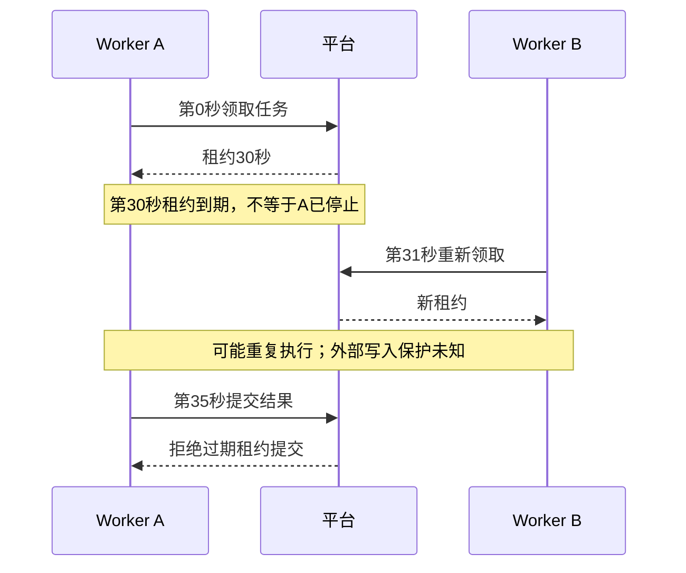

```mermaid
sequenceDiagram
    participant A as Worker A
    participant P as 平台
    participant B as Worker B
    A->>P: 第0秒领取任务
    P-->>A: 租约30秒
    Note over A,P: 第30秒租约到期，不等于A已停止
    B->>P: 第31秒重新领取
    P-->>B: 新租约
    Note over A,B: 可能重复执行；外部写入保护未知
    A->>P: 第35秒提交结果
    P-->>A: 拒绝过期租约提交
```

“任务只执行一次”不成立：重新领取允许重复执行，拒绝A的提交只保护平台结果接收，不能证明外部副作用只发生一次。是否实际重复写入仍需证据。
