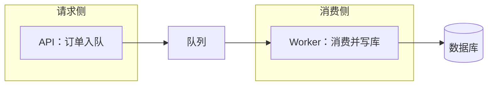

```mermaid
flowchart LR
    subgraph ingress[请求侧]
        A[API：订单入队]
    end
    Q[队列]
    subgraph processing[消费侧]
        W[Worker：消费并写库]
    end
    D[(数据库)]
    A --> Q --> W --> D
```

事实：API入队，Worker消费并写数据库；ADR确认API不直接写库。

尚未确认：为何选择队列、是否为提高吞吐或隔离故障，以及这些效果是否达成。职责分离本身不能证明这些设计原因。
