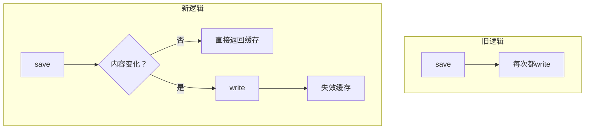

```mermaid
flowchart TD
    subgraph old[旧逻辑]
        O[save] --> OW[每次都write]
    end
    subgraph new[新逻辑]
        N[save] --> C{内容变化？}
        C -->|否| R[直接返回缓存]
        C -->|是| W[write] --> I[失效缓存]
    end
```

改动是跳过未变化内容的写入；内容变化时仍写入，再失效缓存。图中顺序不能交换为先失效再写入。
