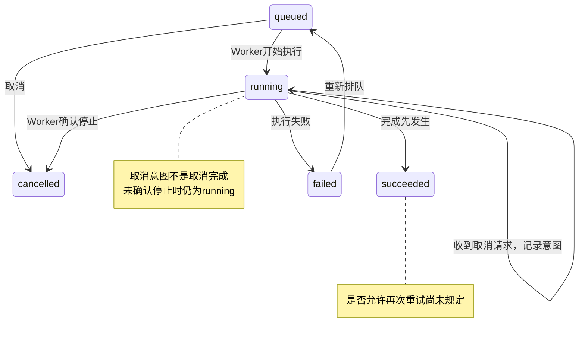

```mermaid
stateDiagram-v2
    queued --> running: Worker开始执行
    queued --> cancelled: 取消
    running --> running: 收到取消请求，记录意图
    running --> cancelled: Worker确认停止
    running --> succeeded: 完成先发生
    running --> failed: 执行失败
    failed --> queued: 重新排队
    note right of running
        取消意图不是取消完成
        未确认停止时仍为running
    end note
    note right of succeeded
        是否允许再次重试尚未规定
    end note
```

取消请求只记录意图；Worker确认停止才完成取消。请求与完成可能竞争，因此收到取消请求后仍可能进入succeeded。没有依据添加succeeded的重试转移。
