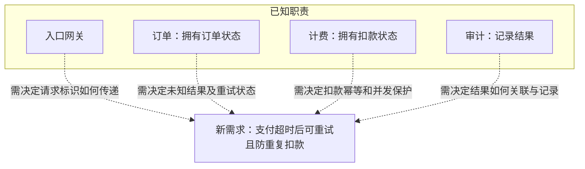

```mermaid
flowchart TB
    subgraph known[已知职责]
        G[入口网关]
        O[订单：拥有订单状态]
        B[计费：拥有扣款状态]
        A[审计：记录结果]
    end
    R[新需求：支付超时后可重试且防重复扣款]
    G -.->|需决定请求标识如何传递| R
    O -.->|需决定未知结果及重试状态| R
    B -.->|需决定扣款幂等和并发保护| R
    A -.->|需决定结果如何关联与记录| R
```

虚线表示评审影响，不代表已有调用链或机制。需明确同一支付的稳定标识、幂等范围与保存方式、外部扣款后崩溃的恢复和结果查询方式；验证并发重试及超时重试不会重复扣款。超时不能直接视为扣款失败。
