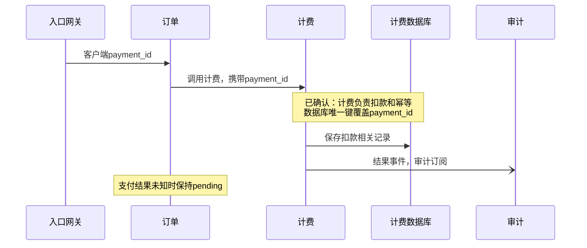

```mermaid
sequenceDiagram
    participant G as 入口网关
    participant O as 订单
    participant B as 计费
    participant D as 计费数据库
    participant A as 审计
    G->>O: 客户端payment_id
    O->>B: 调用计费，携带payment_id
    Note over B,D: 已确认：计费负责扣款和幂等<br/>数据库唯一键覆盖payment_id
    B->>D: 保存扣款相关记录
    B-)A: 结果事件，审计订阅
    Note over O: 支付结果未知时保持pending
```

本次沿用已确认机制，补做两类验证：外部已扣款但本地提交前崩溃后的恢复；同一payment_id并发重试。检查外部只扣一次、结果可恢复、pending最终能收敛。数据库唯一键不能单独证明外部扣款在崩溃窗口也受保护；测试结果尚缺。
