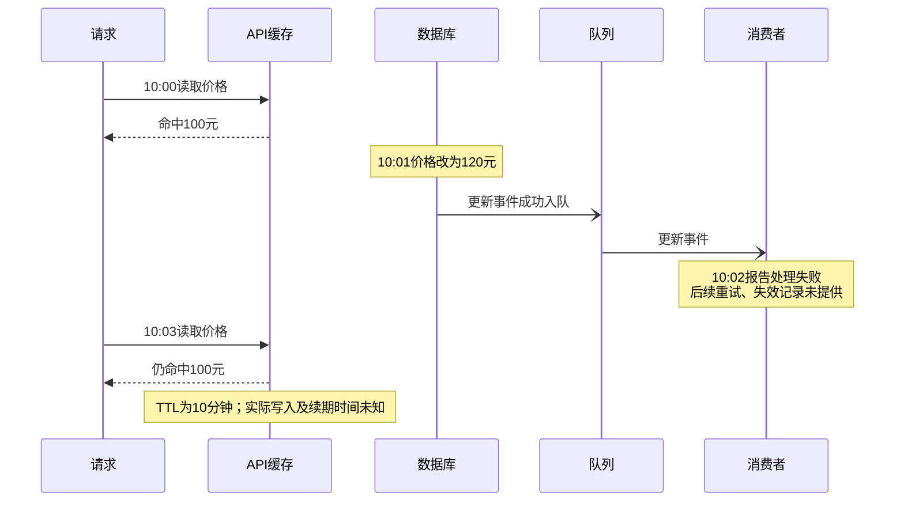

```mermaid
sequenceDiagram
    participant R as 请求
    participant C as API缓存
    participant D as 数据库
    participant Q as 队列
    participant W as 消费者
    R->>C: 10:00读取价格
    C-->>R: 命中100元
    Note over D: 10:01价格改为120元
    D-)Q: 更新事件成功入队
    Q-)W: 更新事件
    Note over W: 10:02报告处理失败<br/>后续重试、失效记录未提供
    R->>C: 10:03读取价格
    C-->>R: 仍命中100元
    Note over C: TTL为10分钟；实际写入及续期时间未知
```

候选解释：消费失败可能阻断缓存失效，旧值仍在TTL内；也可能有失效键不匹配或旧值被重新填充。时间先后不能证明消费失败就是根因，缺少记录也不等于没有重试。

下一步按事件ID追踪失败阶段、重试及死信，核对缓存键与失效日志，再查写入时间、剩余TTL和重新填充来源。10:00命中不代表TTL从10:00开始。
