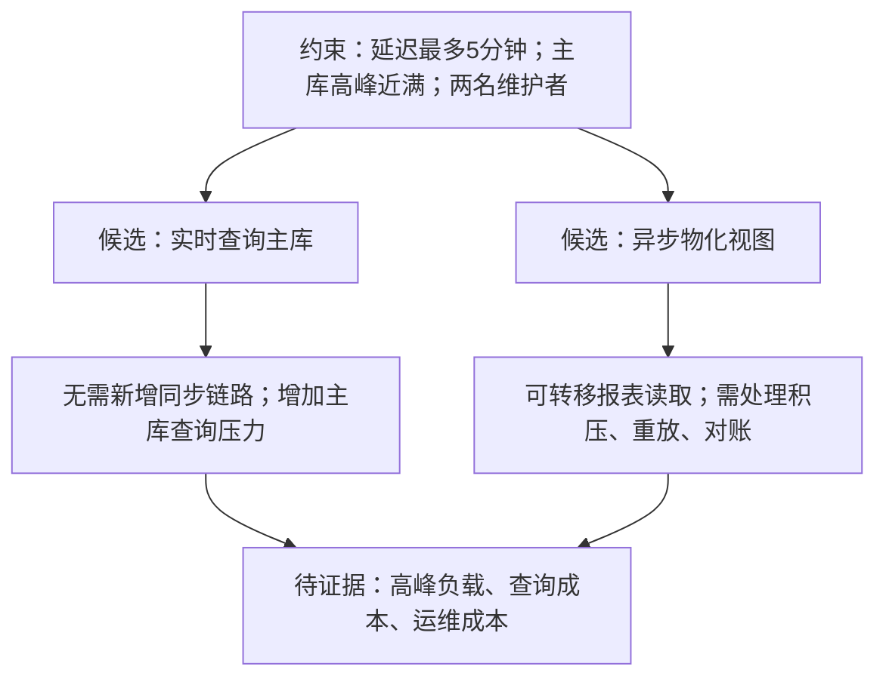

```mermaid
flowchart TB
    C[约束：延迟最多5分钟；主库高峰近满；两名维护者]
    C --> R[候选：实时查询主库]
    C --> V[候选：异步物化视图]
    R --> R1[无需新增同步链路；增加主库查询压力]
    V --> V1[可转移报表读取；需处理积压、重放、对账]
    R1 --> E[待证据：高峰负载、查询成本、运维成本]
    V1 --> E
```

优先验证物化视图：可接受5分钟延迟且主库余量少，但只有在正常及故障恢复时延迟均满足要求、两人能维护链路时才建议采用。若实测实时查询足够轻、仍留有业务容量，实时方案可能更合适。

需要代表性报表的高峰压测、主库资源和业务延迟数据，以及物化视图积压恢复、重放对账演练和维护工时估算。目前尚不能定案。
