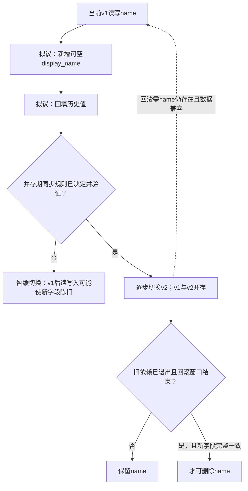

```mermaid
flowchart TD
    A[当前v1读写name] --> B[拟议：新增可空display_name]
    B --> C[拟议：回填历史值]
    C --> D{并存期同步规则已决定并验证？}
    D -->|否| H[暂缓切换：v1后续写入可能使新字段陈旧]
    D -->|是| E[逐步切换v2；v1与v2并存]
    E -.->|回滚需name仍存在且数据兼容| A
    E --> F{旧依赖已退出且回滚窗口结束？}
    F -->|否| K[保留name]
    F -->|是，且新字段完整一致| G[才可删除name]
```

一次回填不能覆盖之后v1对name的写入；v2写display_name后若name未同步，回滚也可能读到旧值。删除name会直接破坏仍运行的v1及回滚路径。

还需决定字段权威来源、并存期同步或兼容策略、冲突与空值处理；验证回填和并发写入的一致性、混合版本读写及回滚。只有v1和其他name依赖全部退出、新字段完整一致、回滚窗口结束后，才可删除name；不能假定已有双写。
