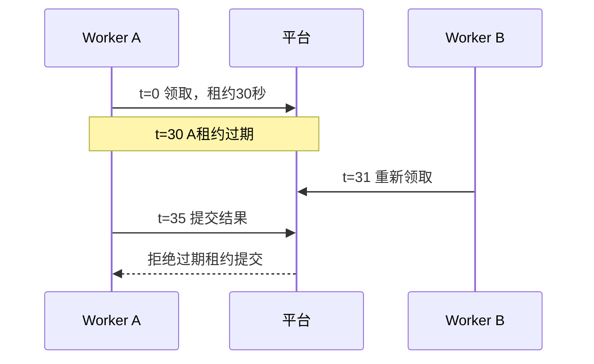

```mermaid
sequenceDiagram
    participant A as Worker A
    participant P as 平台
    participant B as Worker B
    A->>P: t=0 领取，租约30秒
    Note over A,P: t=30 A租约过期
    B->>P: t=31 重新领取
    A->>P: t=35 提交结果
    P-->>A: 拒绝过期租约提交
```
“任务只执行一次”不成立：租约限制结果提交，不能证明执行次数。A、B可能执行同一任务；外部写入是否重复尚无保证，需要外部幂等或隔离机制及验证。
