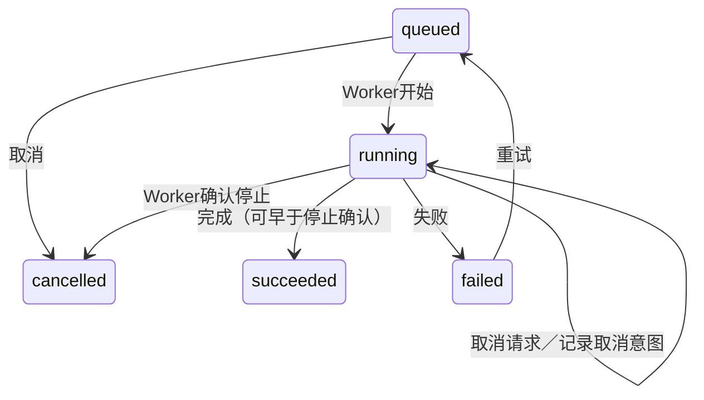

```mermaid
stateDiagram-v2
    queued --> running: Worker开始
    queued --> cancelled: 取消
    running --> running: 取消请求／记录取消意图
    running --> cancelled: Worker确认停止
    running --> succeeded: 完成（可早于停止确认）
    running --> failed: 失败
    failed --> queued: 重试
```
取消请求只记录意图，任务仍是running；取消完成需要Worker确认停止。完成先发生时可进入succeeded。succeeded能否重试未规定，图中不补这条边。
