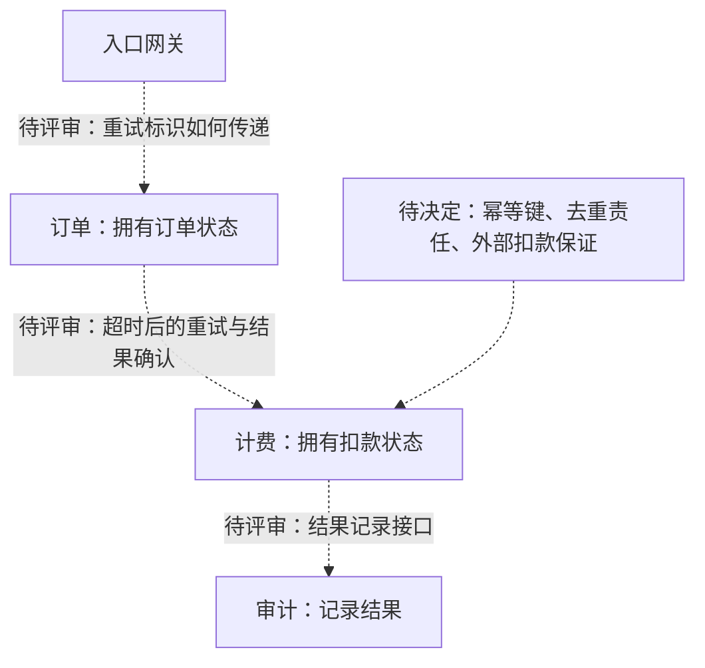

```mermaid
flowchart TB
    G[入口网关] -. 待评审：重试标识如何传递 .-> O[订单：拥有订单状态]
    O -. 待评审：超时后的重试与结果确认 .-> B[计费：拥有扣款状态]
    B -. 待评审：结果记录接口 .-> A[审计：记录结果]
    I[待决定：幂等键、去重责任、外部扣款保证] -.-> B
```
节点职责已确定；虚线表示待评审接口，不能当作已有调用链。

重试会触及入口标识、订单未知结果处理、计费重复扣款防护及审计记录。需决定幂等机制与责任，再验证并发重试、超时但已扣款、崩溃恢复时是否仍只扣一次。
