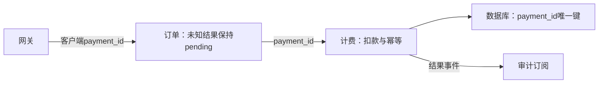

```mermaid
flowchart LR
    G[网关] -->|客户端payment_id| O[订单：未知结果保持pending]
    O -->|payment_id| B[计费：扣款与幂等]
    B --> D[数据库：payment_id唯一键]
    B -->|结果事件| A[审计订阅]
```
以上机制已确认，沿用即可。本次补验证：

- 外部已扣款、本地提交前崩溃：重试是否重复扣款，能否恢复并确认结果。
- 并发重试：同一payment_id是否只产生一次扣款，订单和审计能否得到一致结果。

本地唯一键本身不能证明外部扣款安全；测试结果尚缺，发现缺口后再决定修补。
