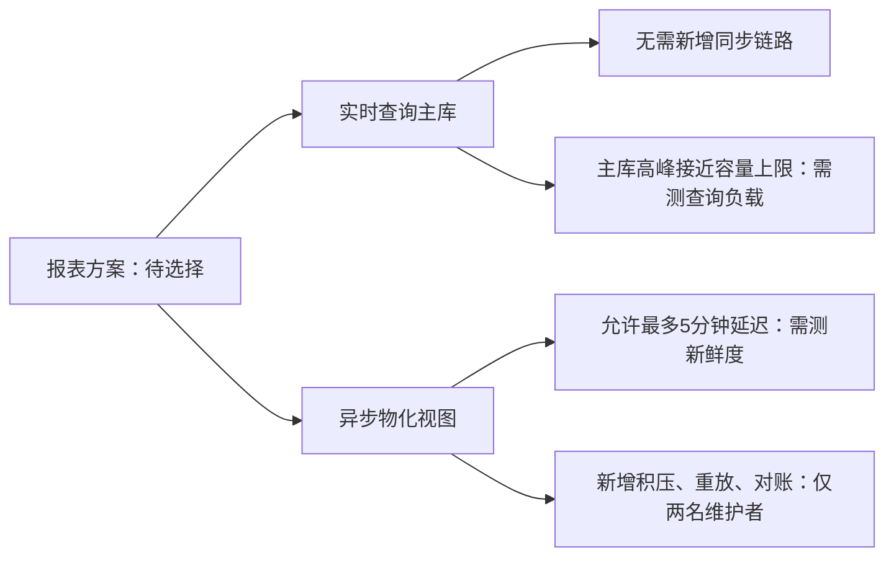

```mermaid
flowchart LR
    R[报表方案：待选择] --> Q[实时查询主库]
    R --> V[异步物化视图]
    Q --> Q1[无需新增同步链路]
    Q --> Q2[主库高峰接近容量上限：需测查询负载]
    V --> V1[允许最多5分钟延迟：需测新鲜度]
    V --> V2[新增积压、重放、对账：仅两名维护者]
```
有条件倾向物化视图：前提是高峰积压及恢复期间仍满足5分钟延迟，且维护成本可承受。若实时查询经测试成本很低、主库仍有足够余量，实时方案也可选。

决定前补齐报表查询成本与高峰负载测试、视图延迟及故障恢复测试、两人团队的运维成本估算；当前尚未定案。
