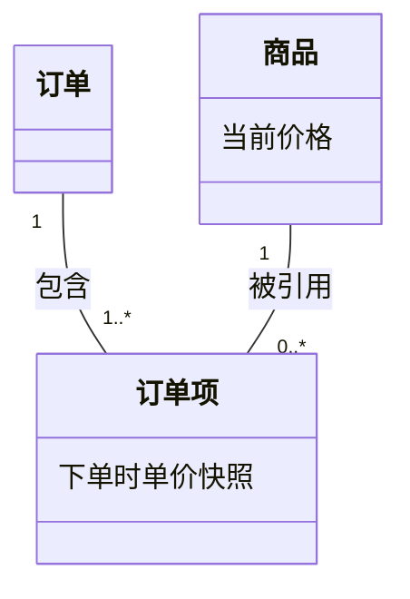

```mermaid
classDiagram
    class 订单
    class 订单项 {
        下单时单价快照
    }
    class 商品 {
        当前价格
    }
    订单 "1" -- "1..*" 订单项 : 包含
    商品 "1" -- "0..*" 订单项 : 被引用
```
每个订单有至少一个订单项；每个订单项恰属一个订单并引用一个商品。商品可被多个订单项引用，也可从未被下单。

订单项单价在下单时保存快照，商品当前价格变化不能改写历史单价。这是领域关系与约束；表、外键、级联删除及ORM实现尚未决定。
