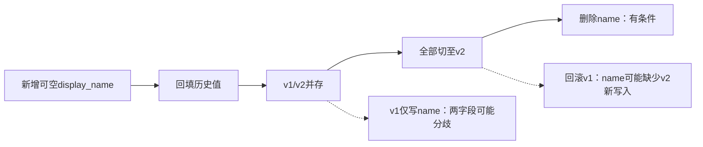

```mermaid
flowchart LR
    A[新增可空display_name] --> B[回填历史值]
    B --> C[v1/v2并存]
    C --> D[全部切至v2]
    D --> E[删除name：有条件]
    C -.-> R[v1仅写name：两字段可能分歧]
    D -.-> F[回滚v1：name可能缺少v2新写入]
```
一次回填不能覆盖后续v1写入；并存期同步策略未决定，切换目前缺少安全条件。

先明确两字段写入同步、冲突处理、v2遇到空值的读取规则，以及回滚时如何保证name包含最新数据，并验证并发写入和回滚。

只有v1及其他name读写者全部退出、数据一致性与完整性验证通过、回滚窗口结束或已准备不依赖name的回滚路径，才能删除name。
