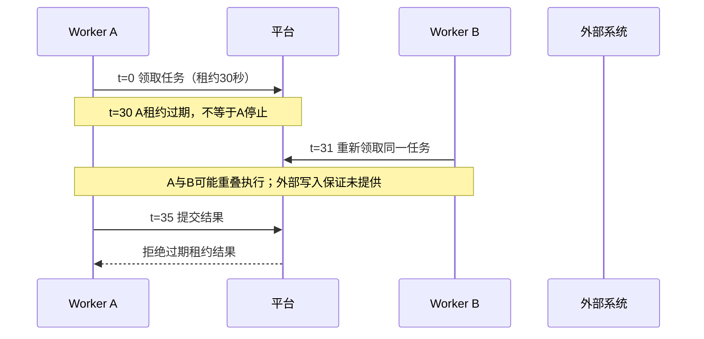

```mermaid
sequenceDiagram
    participant A as Worker A
    participant P as 平台
    participant B as Worker B
    participant E as 外部系统
    A->>P: t=0 领取任务（租约30秒）
    Note over A,P: t=30 A租约过期，不等于A停止
    B->>P: t=31 重新领取同一任务
    Note over A,B: A与B可能重叠执行；外部写入保证未提供
    A->>P: t=35 提交结果
    P-->>A: 拒绝过期租约结果
```

“任务只执行一次”不成立。租约校验限制结果提交，不能证明执行或外部副作用只有一次：A可能已写外部系统，B重新执行又写一次。需核实外部写入的幂等或隔离机制，并验证过期Worker与新Worker重叠的场景；不能从拒绝提交推导外部写入已撤销。

未渲染验证。
