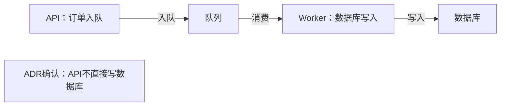

```mermaid
flowchart LR
    A[API：订单入队] -->|入队| Q[队列]
    Q -->|消费| W[Worker：数据库写入]
    W -->|写入| D[数据库]
    N[ADR确认：API不直接写数据库]
```

事实是上述入队、消费、写入职责，以及ADR确认的边界。采用队列是否为了吞吐、故障隔离或其他目标，尚未确认；当前结构不能证明这些设计原因。下一步查原决策记录或向决策者核实理由。

未渲染验证。
