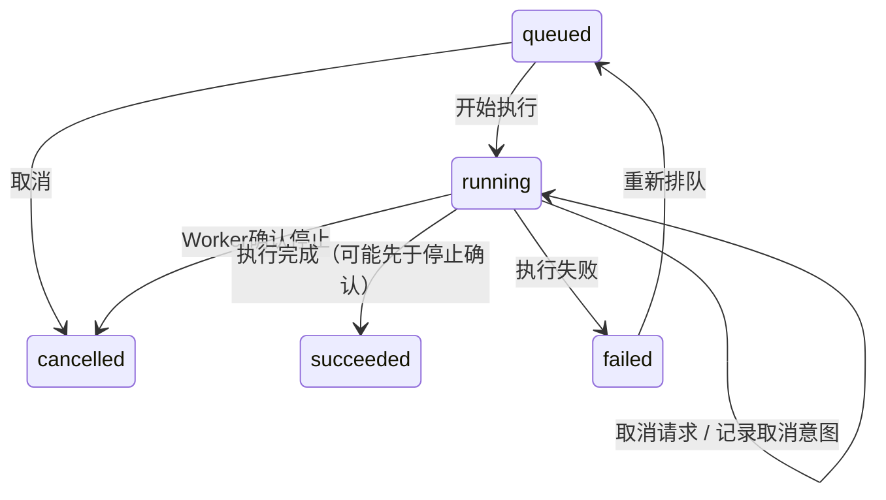

```mermaid
stateDiagram-v2
    queued --> running: 开始执行
    queued --> cancelled: 取消
    running --> running: 取消请求 / 记录取消意图
    running --> cancelled: Worker确认停止
    running --> succeeded: 执行完成（可能先于停止确认）
    running --> failed: 执行失败
    failed --> queued: 重新排队
```

取消请求仅记录意图，任务仍是running；Worker确认停止才算取消完成。请求取消后也可能先完成并进入succeeded，不能承诺请求一到就取消成功。图中开始执行、执行失败为按状态语义推断的转移；succeeded能否重试未规定，需核实规则，不能擅自添加转移或认定不可重试。

未渲染验证。
