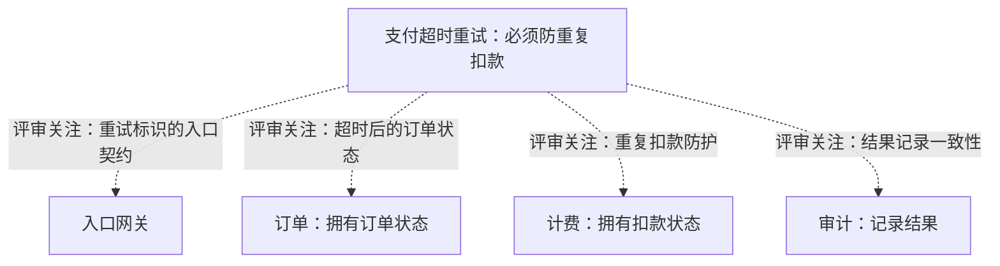

```mermaid
flowchart TB
    R[支付超时重试：必须防重复扣款]
    R -.->|评审关注：重试标识的入口契约| G[入口网关]
    R -.->|评审关注：超时后的订单状态| O[订单：拥有订单状态]
    R -.->|评审关注：重复扣款防护| B[计费：拥有扣款状态]
    R -.->|评审关注：结果记录一致性| A[审计：记录结果]
```

职责是已知决定；虚线仅表示评审关注，不断言模块调用链。超时可能发生在已扣款之后，不能直接按失败重新扣款。

先核实现有重试/幂等契约与相关记录：标识如何贯穿重试，计费如何去重，订单如何识别未知结果。若现有方案不足，再决定幂等责任、标识范围及未知结果恢复方式；验证并发重试和扣款成功但响应丢失两个关键场景。

未渲染验证。
