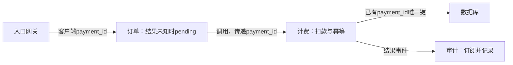

```mermaid
flowchart LR
    G[入口网关] -->|客户端payment_id| O[订单：结果未知时pending]
    O -->|调用，传递payment_id| B[计费：扣款与幂等]
    B -->|已有payment_id唯一键| D[数据库]
    B -->|结果事件| A[审计：订阅并记录]
```

以上职责、标识传递和唯一键均已由设计记录确认，本次沿用。唯一键本身不能证明外部扣款与本地提交之间的异常已安全处理。

本次重点是补验证证据：①外部已扣款、本地提交前崩溃后重试，确认不再扣款且最终结果可恢复；②同一payment_id并发重试，确认扣款次数、数据库结果及返回结果一致。核对现有崩溃恢复路径并验证pending最终如何收敛；发现机制缺口后再讨论改动。

未渲染验证。
