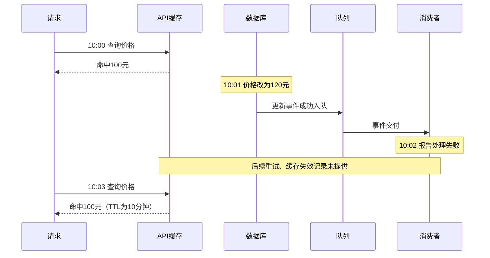

```mermaid
sequenceDiagram
    participant R as 请求
    participant C as API缓存
    participant D as 数据库
    participant Q as 队列
    participant W as 消费者
    R->>C: 10:00 查询价格
    C-->>R: 命中100元
    Note over D: 10:01 价格改为120元
    D->>Q: 更新事件成功入队
    Q->>W: 事件交付
    Note over W: 10:02 报告处理失败
    Note over W,C: 后续重试、缓存失效记录未提供
    R->>C: 10:03 查询价格
    C-->>R: 命中100元（TTL为10分钟）
```

候选原因是失败后未完成缓存失效；也可能失效目标键不匹配，或缓存被旧值重新填充。现有时间线不能证明哪一种导致旧价；TTL为10分钟也不能据10:00命中推算缓存写入时间和确切过期点。

下一步关联同一事件ID核查失败原因及重试/死信记录，再核查相应缓存键的失效、写入和过期时间。用这些证据区分“没失效”“失效错键”和“失效后旧值回填”。

未渲染验证。
