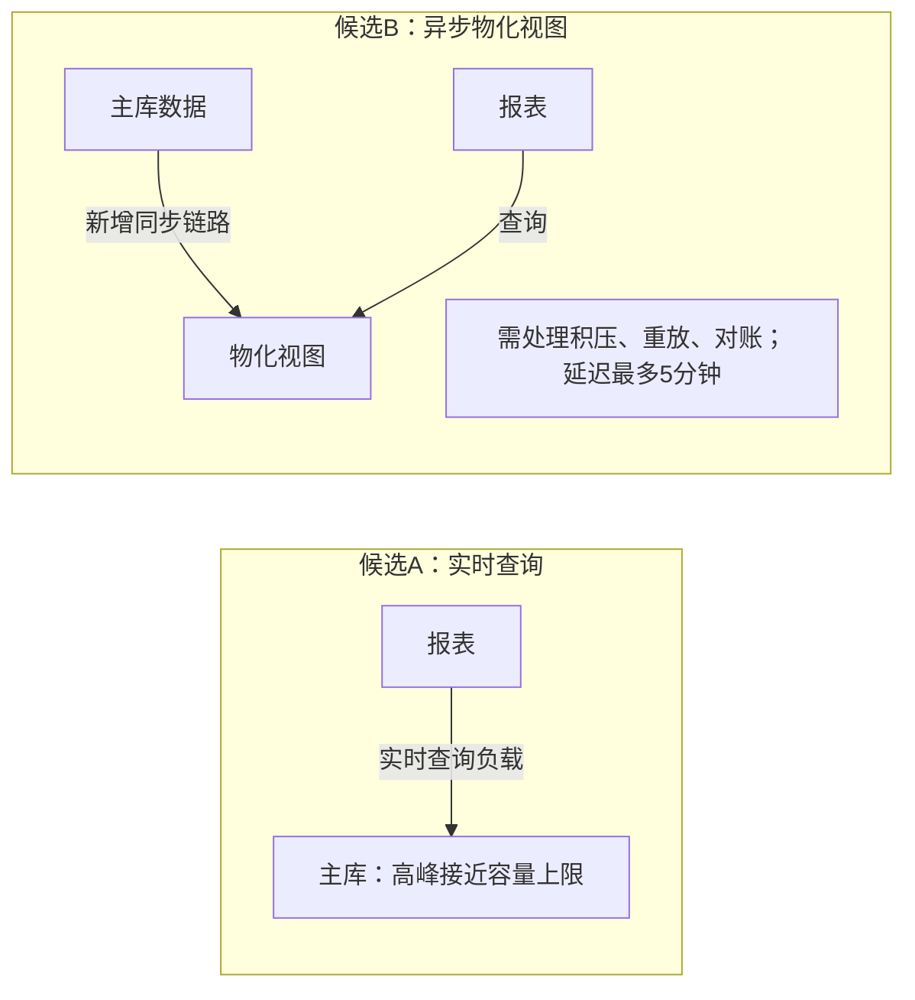

| 取舍 | 实时查询主库 | 异步物化视图 |
|---|---|---|
| 主库影响 | 增加查询负载，成本待测 | 可转移报表查询，同步开销待测 |
| 新增维护负担 | 无新增同步链路 | 两名维护者需承担恢复与对账 |
| 数据时效 | 查询当前主库数据 | 必须验证高峰、故障恢复时仍满足5分钟 |

建议优先验证物化视图：容忍延迟且主库余量小，有采用它的理由，但方案尚未决定。若实际报表查询很轻、主库余量充足，实时查询可能更合算。用代表性报表压测量化主库成本，并演练积压恢复、重放和对账，估算两人团队的维护成本；再据5分钟目标与维护能力选择。

未渲染验证。
