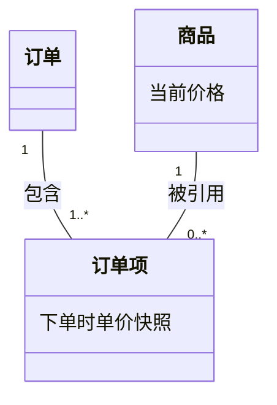

```mermaid
classDiagram
    class 订单
    class 订单项 {
        下单时单价快照
    }
    class 商品 {
        当前价格
    }
    订单 "1" -- "1..*" 订单项 : 包含
    商品 "1" -- "0..*" 订单项 : 被引用
```

这是领域关系：每个订单至少一个订单项；每个订单项只属于一个订单，并引用一个商品。商品可以没有订单项引用，也可被多个订单项引用。

订单项的单价快照用于保留下单时价格，商品当前价格变化不能改写它。图不代表已有表、外键、级联删除或ORM实现；这些实现选择尚未提供。

未渲染验证。
