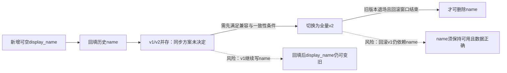

一次回填不能保障并存期一致性；v1不会写display_name，v2可能读到旧值或空值。若v2不维持name，回滚v1也可能读到旧数据；删除name后，v1读写与回滚都会失效。

还缺的决定是并存期两字段如何同步、写入权威与冲突处理，以及v2如何处理空值；不预设已有双写。验证并发更新、回填与在线写入交错、失败恢复和回滚后数据正确性。仅在所有旧读写方已退场、数据校验通过，且回滚窗口结束或另有已验证的回滚路径后，才删除name。

未渲染验证。
