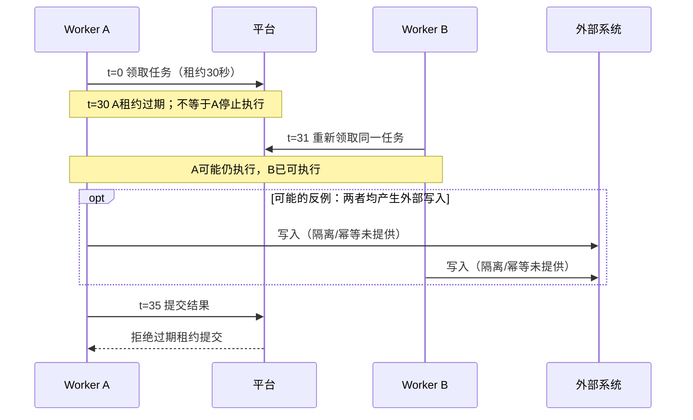

```mermaid
sequenceDiagram
    participant A as Worker A
    participant P as 平台
    participant B as Worker B
    participant E as 外部系统
    A->>P: t=0 领取任务（租约30秒）
    Note over A,P: t=30 A租约过期；不等于A停止执行
    B->>P: t=31 重新领取同一任务
    Note over A,B: A可能仍执行，B已可执行
    opt 可能的反例：两者均产生外部写入
        A->>E: 写入（隔离/幂等未提供）
        B->>E: 写入（隔离/幂等未提供）
    end
    A->>P: t=35 提交结果
    P-->>A: 拒绝过期租约提交
```

“任务只执行一次”不成立为已保证性质：拒绝提交只约束平台接收结果，不能撤销外部副作用，也不能阻止A、B重复执行。图中外部写入是允许的反例，并非已观测事实；需核实外部写入的幂等或隔离契约。

未渲染验证。
