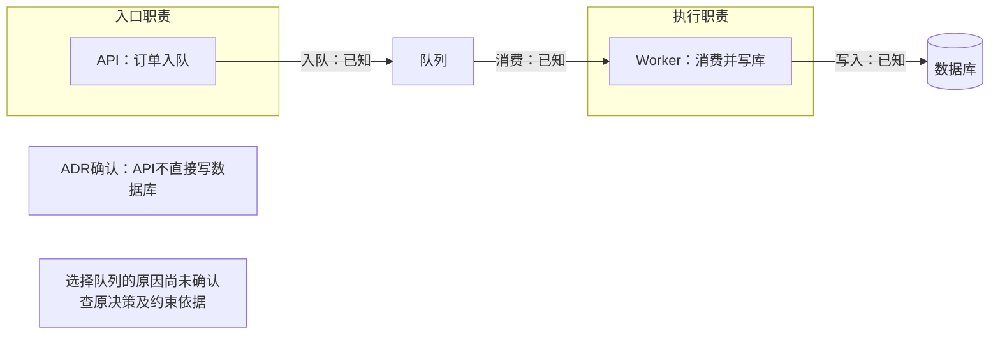

```mermaid
flowchart LR
    subgraph 入口职责
        A[API：订单入队]
    end
    Q[队列]
    subgraph 执行职责
        W[Worker：消费并写库]
    end
    D[(数据库)]
    A -->|入队：已知| Q
    Q -->|消费：已知| W
    W -->|写入：已知| D
    N[ADR确认：API不直接写数据库]
    U[选择队列的原因尚未确认<br/>查原决策及约束依据]
```

事实是图中的入队、消费和写库职责，以及ADR确认的API写库边界。吞吐优化、故障隔离等只能作为待核实的设计理由；现有结构不能证明这些动机，需查原决策记录。

未渲染验证。
