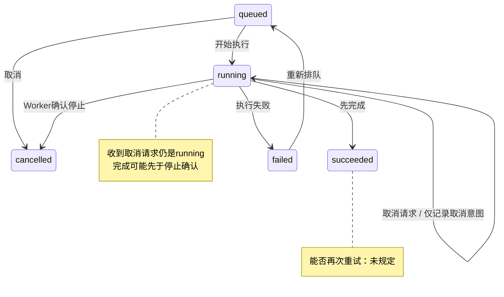

```mermaid
stateDiagram-v2
    queued --> running: 开始执行
    queued --> cancelled: 取消
    running --> running: 取消请求 / 仅记录取消意图
    running --> cancelled: Worker确认停止
    running --> succeeded: 先完成
    running --> failed: 执行失败
    failed --> queued: 重新排队
    note right of running
        收到取消请求仍是running
        完成可能先于停止确认
    end note
    note right of succeeded
        能否再次重试：未规定
    end note
```

取消请求表达意图，取消完成要求Worker确认停止；因此收到请求不保证最终进入cancelled，也可能先进入succeeded。succeeded的重试规则需核实，图中不补设转移。

未渲染验证。
