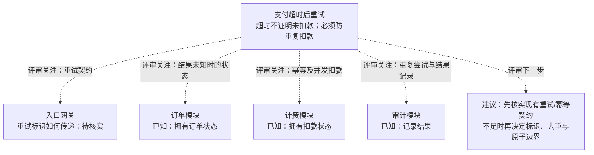

```mermaid
flowchart TB
    R[支付超时后重试<br/>超时不证明未扣款；必须防重复扣款]
    G[入口网关<br/>重试标识如何传递：待核实]
    O[订单模块<br/>已知：拥有订单状态]
    B[计费模块<br/>已知：拥有扣款状态]
    A[审计模块<br/>已知：记录结果]
    R -.->|评审关注：重试契约| G
    R -.->|评审关注：结果未知时的状态| O
    R -.->|评审关注：幂等及并发扣款| B
    R -.->|评审关注：重复尝试与结果记录| A
    C[建议：先核实现有重试/幂等契约<br/>不足时再决定标识、去重与原子边界]
    R -.->|评审下一步| C
```

连线表示评审关注，不代表模块调用关系。先查现有接口、实现和设计记录；没有提供幂等资料不能判定机制不存在。待验证的关键场景是并发重试、已扣款但响应超时，以及崩溃恢复；确认机制不足后再决定补充方案。

未渲染验证。
