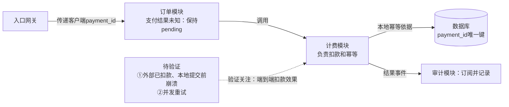

```mermaid
flowchart LR
    G[入口网关] -->|传递客户端payment_id| O[订单模块<br/>支付结果未知：保持pending]
    O -->|调用| B[计费模块<br/>负责扣款和幂等]
    B -->|本地幂等依据| D[(数据库<br/>payment_id唯一键)]
    B -->|结果事件| A[审计模块：订阅并记录]
    V[待验证<br/>①外部已扣款、本地提交前崩溃<br/>②并发重试]
    V -.->|验证关注：端到端扣款效果| B
```

沿用已有设计记录中的职责与唯一键。唯一键本身不足以证明外部扣款全过程幂等；本次应补齐图中两类测试，检查重复扣款、恢复后的结果与pending收敛。测试若暴露缺口，再据证据修正机制。

未渲染验证。
